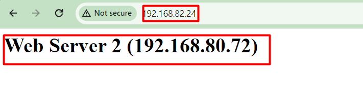
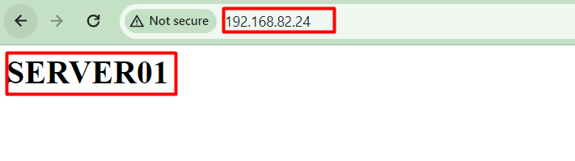

- [Mục lục](#mục-lục)
  - [I. INITIAL CONFIGURATION](#i-initial-configuration)
    - [1. Cấu hình IP Addrress và Subnetmask](#1-cấu-hình-ip-addrress-và-subnetmask)
    - [2. Cấu hình Default Route](#2-cấu-hình-default-route)
    - [3. Bật webui](#3-bật-webui)
    - [4. Cấu hình System Time Zone](#4-cấu-hình-system-time-zone)
  - [II. Server Load Balancing](#ii-server-load-balancing)
    - [1. Round Robin](#1-round-robin)
    - [2. Least Bandwidth](#2-least-bandwidth)
    - [3. Shortest Response](#3-shortest-response)
    - [4. Least Connections](#4-least-connections)


## Mục lục
### I. INITIAL CONFIGURATION
#### 1. Cấu hình IP Addrress và Subnetmask
-  Mục đích : Kiểm tra cấu hình IP address và Subnetmask
- Mô hình:
    
- Mô tả:
  - Sử dụng dây cáp để kết nối console máy tính với thiết bị APV 
  - Cấu hình interface management 
- Các bước thực hiện:
  - Kết nối máy tính với APV bằng dây console
  - Đăng nhập vào giao diện APV/Cli bằng account: 
    > Array/admin
  - Cấu hình Interface mgt theo các câu lệnh sau:
    ```       
    AN#config terminal
    AN(config)#ip address <portnumber> <IP address> <Subnetmask>
    ```
Ví dụ:
AN(config)#ip address "port1" 192.168.30.49  255.255.255.0
  - Kiểm trả kết quả cấu hình bằng câu lệnh:
    > AN# show interface
- Kết quả: 
  - Sau khi cấu hình interface port 1 ta được kết quả show interface như hình dưới
    

#### 2. Cấu hình Default Route
- Mục đích	Kiểm tra cấu hình default route 
- Mô hình:
    
- Mô tả:
  -	Sử dụng Static routing giữa thiết bị APV và Firewall quảng bá vùng mạng Lan (vlan 30) của Firewall với vùng Web-Server của thiết bị APV
  -	Kiểm tra ping giữa Laptop và Server

- Các bước thực hiện: 
  -	Cấu hình Static route trên Firewall
  -	Cấu hình Default route trên thiết bị APV
  - Từ giao diện webui của APV ta truy cập route/basic Routing/default Route, nhập destination IP (4) và chọn (5) để lưu cấu hình 
    
  -	Kiểm tra ping và tracert route giữa laptop và Server
- Kết quả:
  - Ping thành công từ laptop tới server
    
    
  - Ping thành công từ Server tới laptop 
    
    

#### 3. Bật webui 
- Mục đích: Kiểm tra cấu hình webui
- Mô hình:
    
- Mô tả:
  -	Trên giao cli Console, bật tính năng webui
  -	Kết nối máy tính với Port1 của thiết bị APV
  -	Sử dụng trình duyệt đăng nhập webui của thiết bị APV
- Các bước thực hiện:
  -	Cấu hình webui trên cli Console theo các câu lệnh sau:
    > AN(config)#webui on
  -	Kiểm tra trạng thái của webui theo các câu lệnh sau:
    > AN(config)#show webui settings
- Kết quả	
  -	Kết quả kiểm tra trạng thái webui, webui đã bật và đang sử dụng port 8888
    
  -	Kết nối thành công vào webui theo đường dẫn https://192.168.30.49:8888/login
    

#### 4. Cấu hình System Time Zone
- Mục đích: Kiểm tra cấu hình System Time Zone
- Mô hình:
    
- Mô tả:
  - Cấu hình đồng bộ timezone trên giao diện webui
- Các bước thực hiện:
  -	Đăng nhập vào giao diện APV/webui bằng account: 
Array/admin
  -	Từ giao diện webui => vào tab (1)System => chọn (2) general Setting => tùy chọn (3) múi giờ 
    
  -	Đồng bộ System time theo timezone, chọn (1) cửa sổ mới hiện ra chọn (2) để đồng bộ System time theo time zone, lưu cấu hình thay đổi (3)
    
- Kết quả:
  - System time sau đã đồng bộ thành công với System time zone 
    

### II. Server Load Balancing
#### 1. Round Robin
- Mục đích: Kiểm tra Round Robin
- Mô hình:
    
- Mô tả:
  -	Triển khai kiến trúc one-arm ưu điểm không thay đổi gateway và routing trên hệ thống
  -	Chỉ thay đổi IP DNAT trên router với kết nối từ ngoài internet vào web-server
  -	APV chạy mode Reverse Proxy sẽ thay đổi IP Header của gói tin theo bảng trên
  -	APV sử dụng thuật toán Round Robin 
  -	Máy tính kết nối tới web-server bằng virtual IP

- Các bước thực hiện:
  - Kết nối APV với hệ thống như mô hình trên, đảm bảo APV kết nối được với web-server
  - Cấu hình SLB chạy thuật toán Round Robin trên Array
  -	Cấu hình Real Server:
    - Từ trang chủ vào mục SLB(1) => tích chọn Real Servce(2) => chọn Add (3) => chọn http (4)
      
    - Cửa sổ mới hiện ra, nhập các thông tin sau:
      (1) tên Server
      (2) Real ip Address của web-server 01 : 192.168.80.20
      (3) Tùy chỉnh số lượng kết nối tối đa
      (4) Chọn health check loại TCP
      (5) Lưu cấu hình
      
      
  - Làm tương tự với web-server 02 với IP 192.168.80.72 và web-server 03 với IP 192.168.80.73
  -	Cấu hình hình SLB Real Service Group
    - Chuyển sang tab SLB Real Service Group (1) => Chọn Add (2)
    => chọn list các thuật toán (3) và  chọn Round Robin (4)
    
  -	Thêm server vào group
    Cửa sổ mới hiện ra:
      (1) nhập tên group 
      (2) nhập số lượng real Server
      (3) chọn checkbox để enable group 
      (4) lưu cấu hình
    
  - Tích chọn Group SLB vừa tạo
    Cửa sổ mới hiện ra:
      (1) chọn add
      (2) chọn real servel vừa tạo 
      (3) Lưu cấu hình thay đổi
    
  -	Tạo SLB Group Health Check
    - Chuyển sang tab SLB Group Health Check (1) => chọn Add (2)
      
    - Cửa sổ mới hiện ra:
      (1) nhập tên Group health check
      (2) Chọn service loại http các trường thông tin khác để mặc định
      (3) lưu cấu hình
      
  -	Cấu hình virtual Service IP
    - Chuyển sang tab Virtual Service IP (1) => chọn Add (2) => Chọn dịch vụ http (3)
      
    - Cửa sổ mới hiện ra:
      (1) nhập tên virtual Service
      (2) Nhập Virtual IP
      (3) Chọn check box để enable IP
      
  - Cấu hình Reverse proxy mode => Chuyển sang tab Advanced Setting (1) => cửa sổ mới hiện ra
    (2) chọn mode reverse proxy
    (3) Lưu cấu hình thay đổi 
      
  - Sử dụng máy tính kết nối web-server 
  - Kiểm tra kết quả hiển thị trên máy tính và trên Array
  
- Kết quả	
  -	Máy tính kết nối với web-server thành công qua virtual-IP với thuật toán Round robin, lần lượt hiển thị nội dung của web-server 01, web-server 02 và web-server 03
    
    
    
  -	Kiểm tra kết nối trên APV, thể hiện kết nối hiện tại trên  Web-Server 01, Web-Server 02 và Web-Server 03
    

#### 2. Least Bandwidth
- Mục đích: Kiểm tra Least Bandwidth
- Mô hình:
    
- Mô tả:
  -	Triển khai kiến trúc one arm ưu điểm không thay đổi gateway và routing trên hệ thống
  -	Chỉ thay đổi IP DNAT trên router với kết nối từ ngoài internet vào web-server
  -	APV chạy mode Reverse Proxy sẽ thay đổi IP Header của gói tin theo bảng trên
  -	APV sử dụng thuật toán Least Bandwidth
  -	Máy tính kết nối tới web-server bằng virtual IP

- Các bước thực hiện:
  - Kết nối APV với hệ thống như mô hình trên, đảm bảo APV kết nối được với web-server
  - Cấu hình SLB chạy thuật toán Round Robin trên Array
  -	Cấu hình Real Server (cấu hình tương tự Round Robin)
  -	Cấu hình hình SLB Reak Service Group
    Chuyển sang tab SLB Reak Service Group (1) => Chọn Add (2)
    => chọn list các thuật toán (3) và  chọn Least Bandwidth (4)
    
  -	Thêm server vào group (cấu hình tương tự Round Robin)
  -	Tạo SLB Group Health Check (cấu hình tương tự Round Robin)
  -	Cấu hình virtual Service IP (cấu hình tương tự Round Robin)
    - Sử dụng máy tính kết nối web-server 
    - Kiểm tra kết quả hiển thị trên máy tính và trên Array
- Kết quả	
  - Máy tính kết nối với web-server thành công qua virtual-IP với thuật toán Least Bandwidth, hiển thị ngẫu nhiên nội dung của web-server 01, web-server 02 và web-server 03 dựa theo bandwidth mà server đang sử dụng để cung cấp cho kết nối http hiện tại 
  -	Hiện tại Server 03 đang sử dụng ít bandwidth nhất và Server 02 đang sử dụng nhiều bandwidth nhất nên thứ tự request sẽ được gửi lần lượt  Server 03 => Server 01 => Server 02 như hình dưới:
    
    
    
  -	Kiểm tra kết nối trên APV, thể hiện kết nối hiện tại trên  Web-Server 01, Web-Server 02 và Web-Server 03
    

#### 3. Shortest Response
- Mục đích: Kiểm tra Shortest Response
- Mô hình:
    
- Mô tả:
  -	Triển khai kiến trúc one-arm ưu điểm không thay đổi gateway và routing trên hệ thống
  -	Chỉ thay đổi IP DNAT trên router với kết nối từ ngoài internet vào web-server
  -	APV chạy mode Reverse Proxy sẽ thay đổi Header của gói tin theo bảng trên
  -	APV sử dụng thuật toán Shortest Response 
  -	Máy tính kết nối tới web-server bằng virtual IP

- Các bước thực hiện:
  - Kết nối APV với hệ thống như mô hình trên, đảm bảo APV kết nối được với web-server
  - Cấu hình SLB chạy thuật toán Round Robin trên Array
    -	Cấu hình Real Server (cấu hình tương tự Round Robin)
    -	Cấu hình hình SLB Real Service Group 
    - Chuyển sang tab SLB Reak Service Group (1) => Chọn Add (2)
    => chọn list các thuật toán (3) và chọn Shortest Response (4)
      
    -	Thêm server vào group (cấu hình tương tự Round Robin)
    -	Tạo SLB Group Health Check (cấu hình tương tự Round Robin)
    -	Cấu hình virtual Service IP (cấu hình tương tự Round Robin)
  - Sử dụng máy tính kết nối web-server 
  - Kiểm tra kết quả hiển thị trên máy tính và trên Array
- Kết quả	
  - Máy tính kết nối với web-server thành công qua virtual-IP với thuật toán Shortest Response, hiển thị nội dung của web-server 01, web-server 02 và web-server 03 dựa trên server có thời gian response request từ client ngắn nhất
  -	Hình dưới thể hiện thứ tự phản hồi request 1 , request 2 và request 3 là server 02 => server 01 => Server 03
    
     
    
 

-	Kiểm tra kết nối trên APV, thể hiện kết nối hiện tại trên  Web-Server 01,  Web-Server 02 và Web-Server 03
    

#### 4. Least Connections
- Mục đích: Kiểm tra Least Connections
- Mô hình:
    
- Mô tả:
  -	Triển khai kiến trúc one arm ưu điểm không thay đổi gateway và routing trên hệ thống
  -	Chỉ thay đổi IP DNAT trên router với kết nối từ ngoài internet vào web-server
  -	APV chạy mode Reverse Proxy sẽ thay đổi Header của gói tin theo bảng trên
  -	APV sử dụng thuật toán Least Connections làm thuật toán primary và round robin làm thuật toán backup, request sẽ được ưu tiên gửi tới real server có it active connect nhất, sau khi các active trên các server bằng nhau thuật toán round robin sẽ hoạt động để gửi request theo vòng tròn.
  -	Máy tính kết nối tới web-server bằng virtual IP
- Các bước thực hiện:
  - Kết nối APV với hệ thống như mô hình trên, đảm bảo APV kết nối được với web-server
  - Cấu hình SLB chạy thuật toán Round Robin trên Array
  -	Cấu hình Real Server (cấu hình tương tự Round Robin)
  -	Cấu hình hình SLB Real Service Group 
    
 
  -	Thêm server vào group (cấu hình tương tự Round Robin)
  -	Tạo SLB Group Health Check (cấu hình tương tự Round Robin)
  -	Cấu hình virtual Service IP (cấu hình tương tự Round Robin)
  - Sử dụng máy tính kết nối web-server 
  - Kiểm tra kết quả hiển thị trên máy tính và trên Array
- Kết quả	
  - Máy tính kết nối với web-server thành công qua virtual-IP với thuật toán Least connection, hiển thị nội dung của web-server 01, web-server 02 và web-server 03 dựa trên số lượng kết nối 
  -	Hiện tại kết nối trên server 2 đang thấp nhất, request sẽ gửi theo thứ tự  Server 2 => Server 3 => Server 1 như hình dưới:
    
    
    
 
  -	Kiểm tra kết nối trên APV, thể hiện kết nối hiện tại trên  Web-Server 01 Web-Server 02 và Web-Server 03
    
 

  

 


  


