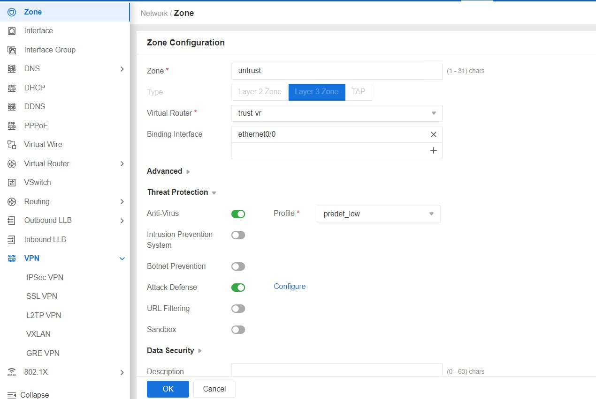

- [Mục lục](#mục-lục)
  - [1. IPS](#1-ips)
  - [2. Anti DDOS](#2-anti-ddos)
  - [3. URL Filtering](#3-url-filtering)
  - [4. L7 App Control](#4-l7-app-control)
  - [5. Tính năng QoS](#5-tính-năng-qos)
  - [7. SSL VPN Remote Access](#7-ssl-vpn-remote-access)

## Mục lục
### 1. IPS
- Mục đích: Kiểm tra tính năng IPS
- Sơ đồ:

    

- Kịch bản:
  - Trên máy 192.168.11.50 thực hiện dowload file mã độc từ web server
  - Người dùng truy cập web server thông qua Firewall Hillstone
  - Trên Firewall Hillstone bật tính năng IPS action detect
  - Kiểm tra khả năng phát hiện trên Firewall khi bật tính năng IPS

- Thực hiện:
  - Trên Firewall Hillstone bật tính năng IPS action detect

    

  - Trên Firewall khi bật tính năng IPS, Firewall đã phát hiện khai thác thông qua signature ID 336482

    

### 2. Anti DDOS
- Mục đích: Kiểm tra tính năng Anti DDOS
- Sơ đồ:

    

- Kịch bản:
  - Kích hoạt tính năng Attack Defense trên Firewall theo từng action Log Only và Drop
  -	Trên máy Attacker 02 (Kali Linux) thực hiện tấn công SYN-flood bằng Hping3 
  -	Check CPU/Memory status và Session summory trước và sau khi tấn công 
  -	Check threat log để xem thông tin cuộc tấn công
  -	Dùng máy Attack 01 thử đăng nhập vào Web IIS với port 80 và Apache 8081 khi firewall Drop Synflood

- Thực hiện:
  - Bật tính năng Attack Defense trên Firewall 
  Từ Tab Network => Zone => Tích chọn Zone Trust => Tích chọn Edit
  Cửa sổ mới hiện ra => chọn tab Threat Protection => Tích chọn checkbox Attack Defense => Chọn Configure

    

  - Cửa sổ mới hiện ra:
  Tích chọn checkbox SYN Flood => điều chỉnh Src Threshold và Dst Threshold theo IP-Based => Action chọn Alarm hoặc Drop.
  Chọn OK – save cấu hình

    

  - Tiến hành tấn công SYN Flood bằng máy Attacker 02 (Kali Linux) bằng Hping3 theo syntax : 
    > hping3 -S –faster  -p 80 192.168.11.100

    

  - Cuộc tấn công Syn Flood được ghi nhận trên firewall

    

  - Khi Firewall đang hoạt động với action Drop Syn-flood (máy kali vẫn đang thực hiện việc tấn công victim01) thử dùng trình duyệt trên máy Attack 01 (window 7) đăng nhập vào web IIS 80 và Apache 8081 của máy victim 01. Đăng nhập thành công Web IIS 

    

### 3. URL Filtering
- Mục đích: Kiểm tra tính năng URL Filtering
- Sơ đồ:

    

- Kịch bản:
  - Trên Firewall bật tính năng URL Filter thực hiện block kết nối người dùng trong hệ thống đến trang website antoanthongtin.vn
  - Trên máy ubuntu 192.168.20.20 sẽ không truy cập được website antoanthongtin.vn
- Thực hiện:
  - Trước khi chặn 

    

  - Cấu hình profile URL Filtering:

    

  - Bật tính năng URL Filtering trong policy

    

  - Sau khi chặn 

    

### 4. L7 App Control
- Mục đích: Bật tính năng app control chặn một số ứng dụng không mong muốn.
- Sơ đồ:

    

- Kịch bản:
  - Trên Firewall bật tính năng app control thực hiện chặn ứng dụng AnyDesk kết nối cho người dùng trong hệ thống
- Thực hiện:
  - Trước khi chặn 

    

  - Cấu hình policy thực hiện block ứng dụng anydesk kết nối cho người dùng trong hệ thống

    

  - Sau khi chặn 

    
### 5. Tính năng QoS
- Mục đích: Kiểm tra tính năng QoS
- Sơ đồ:

    

- Kịch bản:
  - Cấu hình QoS trên Hillstone Firewall 192.168.120.50. Thực hiện giới hạn pipe băng thông forward và backward cho mỗi IP người dùng là 10 Mbps
  - Thực hiện tải app sangit.exe trên máy 192.168.20.20
  - Kiểm tra monitor QoS trên Hillstone Firewall
  - Note: Real-time chỉ có 1 IP người dùng truy cập Internet

- Thực hiện:
  - Cấu hình QoS

    
    
    
    

  - Tải app snagit.exe trên máy 192.168.20.20

  - Thông tin monitor QoS trên Hillstone Firewall 

    

### 7. SSL VPN Remote Access
- Mục đích: Kiểm tra tính năng VPN Remote Access
- Sơ đồ:

    

- Kịch bản:
  - Cấu hình tính năng VPN Remote Access và tạo các user cho phép remote access trên Firewall.
  -	Trên Security Policy : chọn user cho từng policy đi vào từng vùng mạng khác nhau.
  -	Thực hiện remote access kiểm tra.

- Thực hiện:
  - Bước 1: Tạo tunnel interface

    - (1). Đặt tên cho Tunnel interface là tunnel1.
    - (2). Trong Binding Zone chọn Layer 3 Zone và chọn zone cho tunnel này. 
    - (3). Trong IP configuration, chọn Static IP và điền IP Address và Netmask.
    - (4). Trong Management, chọn các hình thức truy cập khi remote access.
    - (5). Chọn Tunnel type: SSL VPN, trong VPN name chọn tên VPN đã tạo và nhấn Add.

    

  - Bước 2: Cấu hình VPN.
    - Trong tab Network, chọn VPN -> chọn SSL VPN:
    - Đặt tên cho SSL VPN Name, trong AAA server chọn Local và nhấn Add.

    

  - Trong tab Interface: 
    -	Phần Egress interface: chọn interface lắng nghe yêu cầu từ máy khách SSL VPN. Trong tunnel interface chọn tunnel đã tạo trên bước 1. Trong Address pool khai báo Start IP, End IP và Netmask

    

    - Trong tab Tunnel route chọn route cho phép tới các dải

    

    - Trong tab Binding Resource, chọn user đăng nhập vpn (đã tạo trong local  user)

    

  - Bước 3: Trong Security policy, chọn user cho từng policy đi vào từng vùng mạng khác nhau

    
    

    - Thực hiện tải SSL VPN client tại:
      > https://192.168.120.50:4433

    

