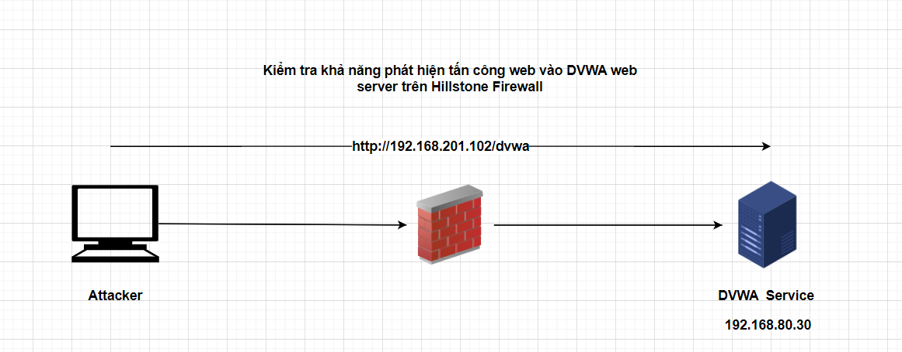
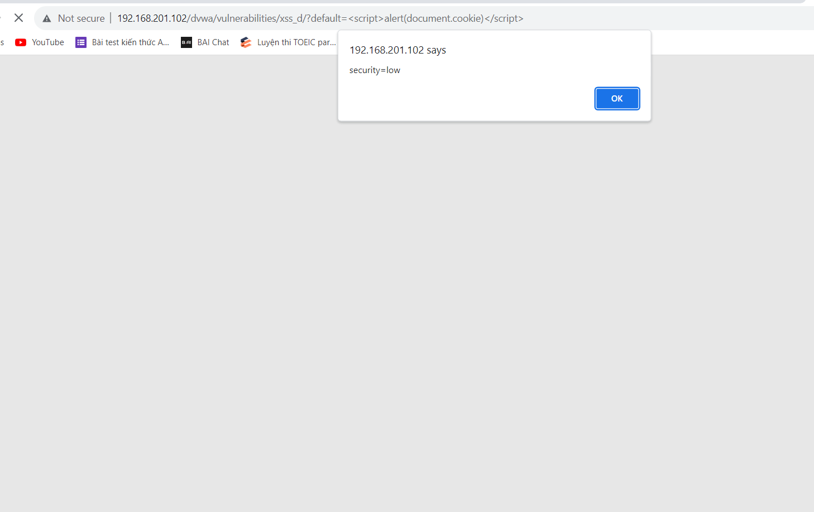
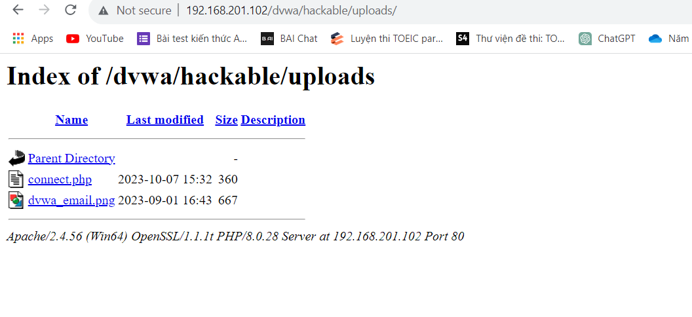

## Kiểm tra khả năng phát hiện tấn công trên Hillstone Firewall
 
- Kịch bản:
  - Truy cập vào dịch vụ http://192.168.201.102/dvwa khai thác tấn công vào DVWA
  - Cấu hình trên Firewall:
    - Cấu hình policy bật tính năng IPS chọn profile web-server.
    - Cấu hình DNAT. Các người dùng truy cập vào DVWA thông qua địa chỉ NAT 192.168.201.102 port 80. Trên FW.
    - Truy cập dịch vụ http://192.168.201.102/dvwa. Khai thác tấn công vào DVWA
    - Kiểm tra khả năng phát hiện trên Hillstone Firewall.


- Cấu hình Firewall:
    Policy => Security Policy => Policy
    Bật IPS và chọn profile

    
    

  - Cấu hình DNAT

    
    
### 1. Tấn công SQL Injection
- Mục đích: Kiểm tra khả năng phát hiện tấn công SQL Injection vào DVWA web server trên Hillstone Firewall
- Sơ đồ:

    

- Thực hiện
  - Thực hiện khai thác SQL Injection có sẵn trên DVWA server
  
    ![alt]

  - Trên Firewall khi bật tính năng IPS profile web_server đã phát hiện được tấn công khai thác SQL Injection

    

### 2. Tấn công XSS
- Mục đích: Kiểm tra khả năng phát hiện tấn công XSS vào DVWA web server trên Hillstone Firewall
- Sơ đồ:

    

- Thực hiện:
  - Thực hiện khai thác XSS có sẵn trên DVWA server
  
    

  - Khai thác XSS (DOM)
    
    
    
    

  - Khai thác XSS (Reflected)  

    
    

  - Khai thác XSS (Stored)

    
    

  - Trên Firewall khi bật tính năng IPS profile web_server đã phát hiện được tấn công khai thác XSS

    

    - Khai thác XSS (DOM)

    

    - Khai thác XSS (Reflected)

    

    - Khai thác XSS (Stored)

    

### 3. Tấn công Command Injection
- Mục đích: Kiểm tra khả năng phát hiện tấn công Command Injection vào DVWA web server trên Hillstone Firewall
- Sơ đồ:

    

- Thực hiện
  - Thực hiện khai thác Command Injection có sẵn trên DVWA server
  
    

  - Trên Firewall khi bật tính năng IPS profile web_server đã phát hiện được tấn công khai thác Command Injection

    
### 4. Tấn công File Inclusion
- Mục đích: Kiểm tra khả năng phát hiện tấn công File Inclusion vào DVWA web server trên Hillstone Firewall
- Sơ đồ:

    

- Thực hiện
  - Thực hiện lựa chọn File inclusion => file1.php
  
    
    

  - Thực hiện sửa đường dẫn http://192.168.201.102/DVWA/vulnerabilities/fi/?page=file1.php thành
http://192.168.201.102/DVWA/vulnerabilities/fi/?page=/etc/passwd

    

  - Trên Firewall khi bật tính năng IPS profile web_server đã phát hiện được tấn công khai thác File Inclusion

    

### 5. Tấn công File Upload
- Mục đích: Kiểm tra khả năng phát hiện tấn công File Upload vào DVWA web server trên Hillstone Firewall
- Sơ đồ:

    

- Thực hiện
  - Thực hiện khai thác File Upload có sẵn trên DVWA server
  
    

  - Thực hiện sửa đường dẫn truy cập http://192.168.201.102/DVWA/hackable/uploads/ và chọn file test.php để chạy. Từ file đó hacker có thể khai thác hệ thống
  
    

  - Trên Firewall khi bật tính năng IPS profile web_server đã phát hiện được tấn công khai thác File Upload

    

### 6. Tấn công Brute Force
- Mục đích: Kiểm tra khả năng phát hiện tấn công Brute Force vào DVWA web server trên Hillstone Firewall
- Sơ đồ:

    

- Thực hiện
  - Thực hiện khai thác Brute Force có sẵn trên DVWA server
  
    
  - Thực hiện tấn công bằng tool hydra trên kali
    ```
    hydra 192.168.201.102 -l admin -p /root/pass.txt http-get-form "/dvwa/vulnerabilities/brute/index.php:username=^USER^password=^PASS^&Login=Login:Username and/or password incorrect" -t 1
    ```

    

  - Trên Firewall khi bật tính năng IPS profile web_server đã phát hiện được tấn công khai thác Brute Force

    

### 7. Tấn công CSRF
- Mục đích: Kiểm tra khả năng phát hiện tấn công CSRF vào DVWA web server trên Hillstone Firewall
- Sơ đồ:

    

- Thực hiện
  - Thực hiện khai thác CSRF có sẵn trên DVWA server
  
    

  - Trên kali sử dụng câu lệnh

    

  - Trên Firewall khi bật tính năng IPS profile web_server chưa phát hiện được tấn công khai thác CSRF

### 8. Sử dụng tool dò quét kiểm tra tính năng IPS web server trên Firewall
- Mục đích: Kiểm tra tính năng IPS web server trên Hillstone Firewall
- Sơ đồ:

    

- Kịch bản:
  - Sử dụng tool burp suite thực hiện dò quét vào DVWA Server 192.168.201.102

- Thực hiện:
  - Sử dụng tool burp suite thực hiện dò quét vào DVWA Server 192.168.201.102

    
    

  - Trên Firewall khi bật tính năng IPS profile web_server đã phát hiện được tấn công khai thác XSS, SQL Injection

    

### 9. Sử dụng nmap scan port trên dvwa
- Mục đích: Kiểm tra tính năng IPS web server trên Hillstone Firewall
- Sơ đồ:

    

- Kịch bản:
  - Sử dụng nmap scan vào DVWA Server 192.168.80.30

- Thực hiện:
  - Sử dụng nmap thực hiện dò quét vào DVWA Server 192.168.80.30

    

  - Trên Firewall khi bật tính năng IPS profile web_server đã phát hiện được hành động scan

    


