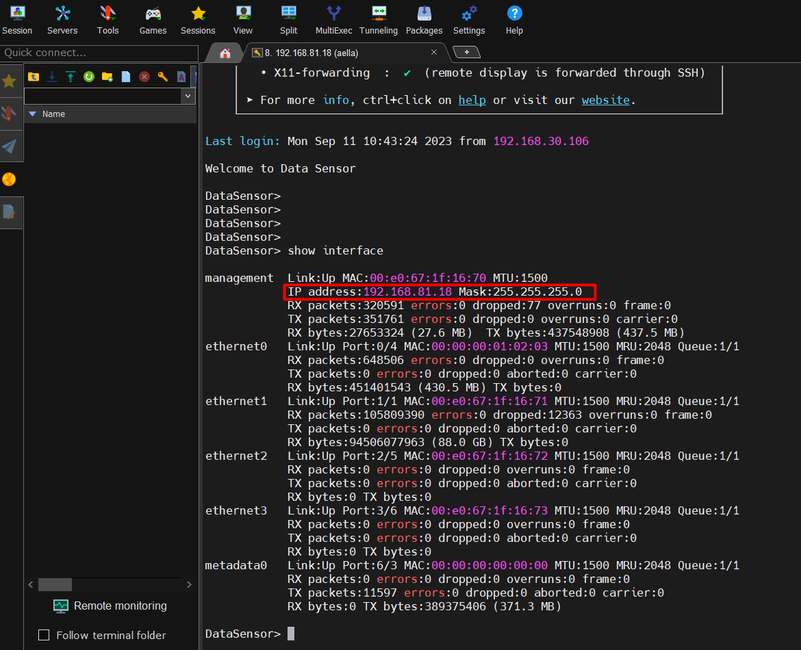
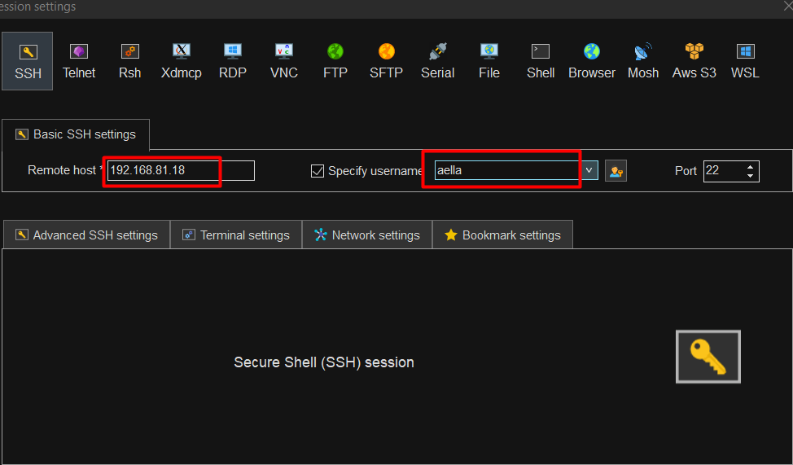
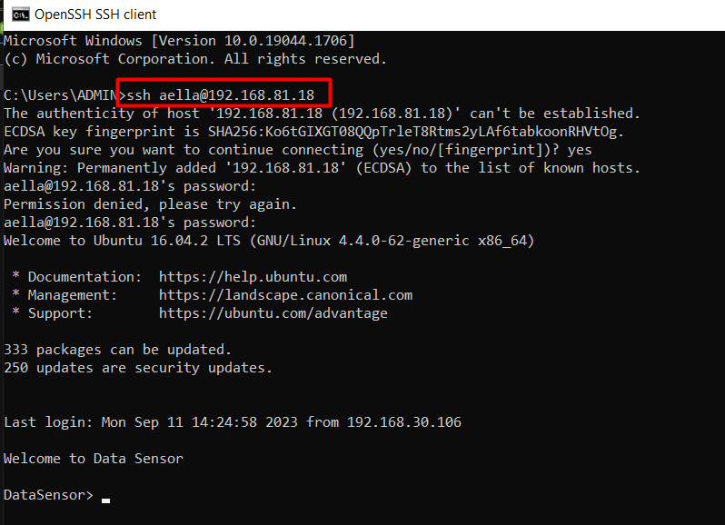
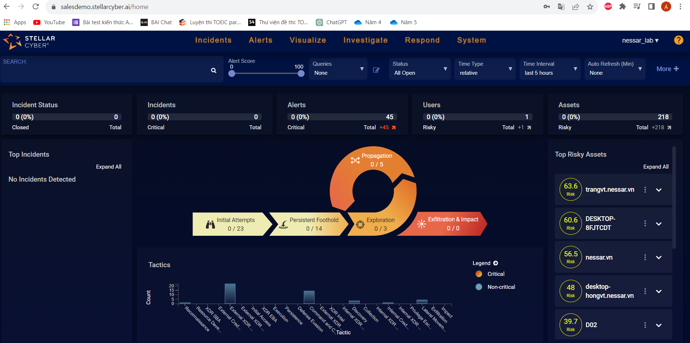

### Mục lục
#### 1. Setup stellar


- Cắm dây console
- Setup 
  ```
  set interface management ip 192.168.81.18
  set interface management gateway 192.168.81.1
  set interface management dns 8.8.8.8
  ```
- Show interface

    

- SSH đến stellar

    

    


- Đăng nhập hệ thống stella
  > salesdemo.stellarcyber.ai

  

- 
