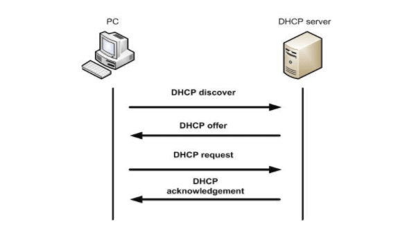
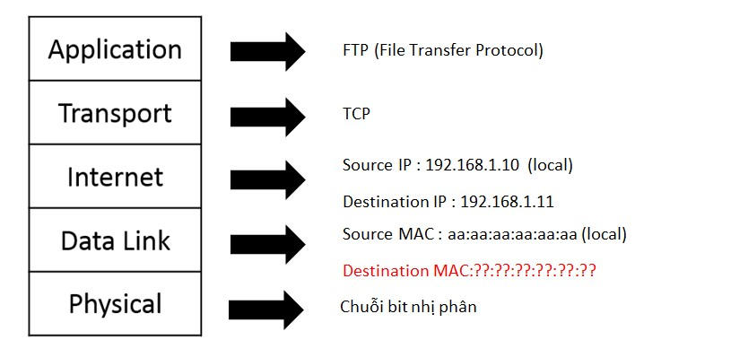

### 3. Bản tin DHCP, ARP, DNS
**3.1: DHCP**
- *DHCP(Dynamic Host Configuration Protocol)*: là một cơ chế hoạt động nhằm giúp tự động hóa việc gán địa chỉ IP cho các máy chủ cố định và máy chủ di động được kết nối có dây hoặc không có dây
- DHCP hoạt động theo dạng Client/Server (Client: port 68, Server: port 67)
- Các địa chỉ phân tán DHCP không được gán vĩnh viễn cho các máy chủ. Nếu máy chủ bị tắt nguồn hoặc tắt mạng, địa chỉ sẽ được trả về nhóm để sử dụng lại
- Vai trò của DHCP trong một hệ thống mạng
  - DHCP giúp công tác quản trị hệ thống mạng được tự động, tiện lợi và tập trung. Bằng cách tự động gán địa chỉ IP cho thiết bị khi truy cập internet, tiết kiệm rất nhiều thời gian so với cấu hình thủ công, giảm rủi ro phát sinh lỗi.
  - DHCP đóng vai trò tự động cấp IP và cung cấp các thông số truy cập mạng. Từ đó, giúp công tác quản trị trở nên đơn giản hơn rất nhiều. Giảm tối đa khả năng phát sinh lỗi do cấu hình thủ công
- Ưu, nhược điểm khi sử dụng DHCP
  - Ưu điểm:
    - Giúp các thiết bị kết nối mạng nhanh chóng từ máy tính, laptop, điện thoại...
    - Quản lý địa chỉ IP dễ dàng, khoa học, tránh trùng IP
    - Các nhà quản trị mạng có thể thay đổi cấu hình và thông số của IP để nâng cấp cơ sở hạ tầng
    - Các thiết bị có thể di chuyển tự do từ mạng này sang mạng khác và nhận IP mới tự động
  - Nhược điểm:
    - DHCP có thể gây rủi ro bảo mật vì bất kỳ thiết bị nào được kết nối với mạng đều có thể nhận địa chỉ
    - Thường chỉ được sử dụng tại các hộ gia đình hoặc mô hình mạng nhỏ
- Các bản tin trao đổi của DHCP
  
  - Cơ chế hoạt động 
    - DHCP Client gửi gói tin `DHCP DISCOVER` dạng broadcast đến DHCP Server
    - DHCP Server gửi gói tin `DHCP OFFER` dạng broadcast đến DHCP Client
    - DHCP Client gửi gói tin `DHCP REQUEST` dạng broadcast đến DHCP Server
    - DHCP Server gửi gói tin `DHCP ACKNOWLEDGE` dạng broadcast đến DHCP Client
  - **DHCP DISCOVER:**    
    - Bản tin Discorver chứa các thông tin cần thiết như thuê bao, mã phản hồi, địa chỉ phản hồi, nhà sản xuất và phiên bản trình điều khiển mạng
  - **DHCP OFFER:**
    - Bản tin Offer chứa thông tin địa chỉ IP mà máy chủ đề xuất cấp phát cho máy khách, thời gian thuê địa chỉ, subnet mask, địa chỉ broadcast và thông tin cấu hình mạng khác
  - **DHCP REQUEST:**
    - là gói tin được DHCP client phản hồi với máy chủ sau khi nhận được DHCP Offer để thể hiện sự chấp nhận đối với địa chỉ IP.
  - **DHCP ACKNOWLEDGE:** 
    - Là một gói tin được DHCP server gửi đến cho Client để xác thực việc chấp nhận DHCP Request và định hướng các tham số tùy chọn cho phép Client tham gia mạng TCP/IP và hoàn thành hệ thống khởi động.
    - Bản tin Acknowledge chứa thông tin xác nhận rằng địa chỉ IP đã được cấp phát cho máy khách, cùng với các cấu hình mạng bổ sung như địa chỉ gateway, DNS và các thông số khác
  - Nếu DHCP Server và DHCP Client nằm khác miền quảng bá, thì cần thiết phải sử dụng một thiết bị trung gian để chuyển tiếp yêu cầu từ Client đến Server. Vì trong trường hợp này các gói tin(local) broadcast từ Client bị Router chặn nên sẽ không đến được DHCP Server

**3.2: ARP** 
- *ARP(Address Resolution Protocol):* là giao thức để tìm địa chỉ phần cứng (địa chỉ MAC) của thiết bị từ một địa chỉ IP
- PC1 muốn giao tiếp PC2. PC1 biết địa chỉ IP của PC2, sử dụng dịch vụ FTP
  
  Lúc này PC1 không biết địa chỉ MAC của PC2. Để tìm được thì PC1 cần gửi ARP Request cho PC2. Khi PC2 nhận được, PC2 sẽ trả lời bằng gói ARP Reply, chứa thông tin địa chỉ MAC của PC2 cho PC1
    - Nếu Destination IP cùng subnet với Source IP thì ARP sẽ tìm địa chỉ MAC của chính IP đó
    - Nếu Destination IP khác subnet với Source IP thì ARP sẽ tìm địa chỉ MAC của Default Gateway

|  ARP Request | ARP Reply  |
|---|---|
|  Là gói tin mà máy gửi gửi broadcast để tìm địa chỉ MAC của máy nhận |  Là gói tin có chứa địa chỉ MAC của mình mà máy nhận sau khi nhận được ARP Request sẽ gửi gói tin reply về cho máy gửi |
|  Là gói tin broadcast | Là gói tin Unicast  |

- Ưu điểm của ARP:
  - Với ARP, các địa chỉ MAC có thể dễ dàng được tìm thấy nếu người dùng đã biết được địa chỉ IP của cùng một hệ thống
  - Là một giao thức bảo mật có độ an toàn cao
  - Mục đích của ARP là enable mọi host trên mạng cho phép người dùng tạo một ánh xạ giữa địa chỉ IP và địa chỉ vật lý

**3.3: DNS** 
- *DNS (Domain Name System):* là một phần quan trọng trong hệ thống Internet hiện đại. Nó giúp kết nối các máy tính trên mạng bằng cách chuyển đổi tên miền thành địa chỉ IP tương ứng và ngược lại
- DNS khi dịch tên miền như vậy giúp trình duyệt đọc hiểu và đăng nhập vào dễ dàng. Khi đăng nhập vào một trang website, chỉ cần nhớ và nhập tên website. Sau đó, trình duyệt sẽ tự động nhận diện thay vì phải nhớ những địa chỉ IP phức tạp. Việc này giúp người dùng tiết kiệm thời gian khi truy cập các trang web đã từng dùng trước đó 
- Mỗi máy tính khác nhau trên Internet đều có một địa chỉ IP duy nhất được dành riêng. Địa chỉ IP này làm nền tảng để tạo lập kết nối các máy khách với máy chủ để bắt đầu kết nối. Các thiết bị này sẽ giao tiếp nhau thông qua DNS
- Cơ chế hoạt động của DNS
  - Bước 1: Chương trình trên máy người dùng gửi yêu cầu tìm địa chỉ IP ứng với tên miền cần tìm tới máy chủ quản lý tên miền( name server) cục bộ thuộc mạng của nó
  - Bước 2: Name server kiểm tra trong cơ sở dữ liệu của nó có chứa cơ sở dữ liệu chuyển đổi từ tên miền sang tên địa chỉ IP của tên miền mà người sử dụng yêu cầu không. 
  - Bước 3:
    - Nếu có, nó sẽ gửi trả lại địa chỉ IP của máy có tên miền yêu cầu
    - Nếu không có, Name server sẽ quay về tìm trong cache – bộ nhớ tạm của phần cứng hay phần mềm. Nơi phổ biến nhất thường lưu thông tin này chính là bộ nhớ tạm của trình duyệt và bộ nhớ tạm ISP (Internet Service Providers). Nếu không nhận được thông tin, bạn sẽ thấy mã bị lỗi hiện lên. 
- 