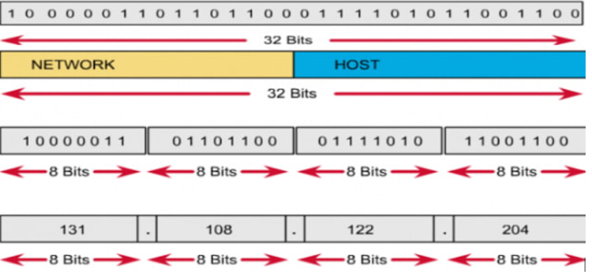
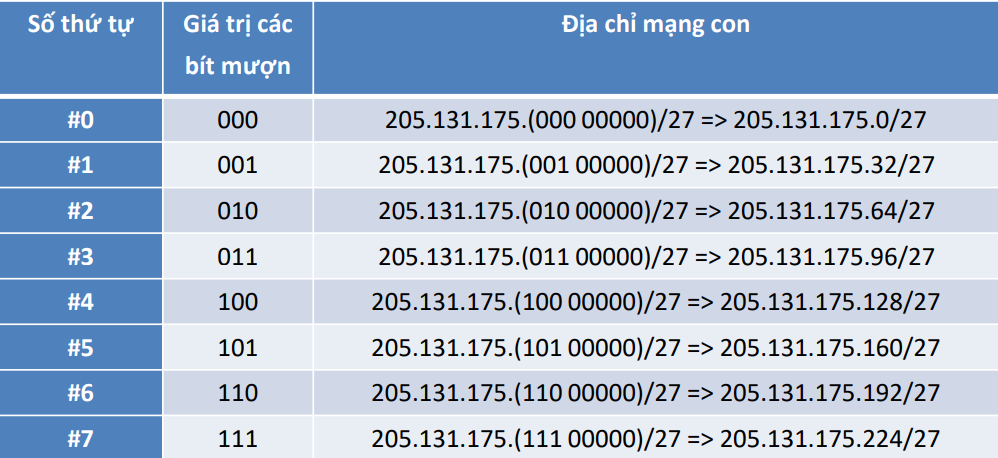

### 2. Địa chỉ IPv4 và IPv6
**2.1: Địa chỉ IPv4**
- IPv4 (Internet Protocol version 4) là một hệ thống định danh địa chỉ mạng duy nhất được sử dụng trong IP để định vị và xác định các thiết bị trong mạng
- IPv4 là giao thức được triển khai rộng rãi nhất ở tầng liên mạng
- Biểu diễn và phân loại địa chỉ IPv4
  - Địa chỉ IPv4 32 bit được tách thành 4 octet, mỗi octet là 1 nhóm 8 bit
  - Thường được viết dưới dạng thập phân có dấu chấm để phân tách giữa các octet
  >Ví dụ: 192.168.1.2
  
- Không gian địa chỉ IP được chia thành 5 lớp A, B, C, D và E
  - Các bit đầu tiên được dùng để định danh lớp địa chỉ (0 - Lớp A(1-126), 10 - Lớp B(128-191), 110-Lớp C(192-223), 1110-Lớp D(224-239), 1111-Lớp E)
  - Các lớp A, B, C được dùng để gán cho các host
  - Lớp D là lớp địa chỉ multicast
  - Lớp E không dùng
- Địa chỉ IP các lớp A, B và C có hai phần: Định danh mạng
(Net_ID) và định danh máy (Host_ID)
  - Các bit Net_ID không được phép đồng thời là 0
  - Các bit Host_ID sử dụng để xác định phần địa chỉ máy
    - Các bit Host_ID đồng thời là 0: dành riêng cho địa chỉ mạng
    - Các bit Host_ID đồng thời là 1: dành riêng cho địa chỉ quảng bá (broadcast)
    - Địa chỉ quảng bá của một mạng là địa chỉ IP dùng để đại diện cho tất cả các host trong mạng

- 2 kỹ thuật phân chia mạng con
  - *Kỹ thuật chia mạng con-Subnetting*
    - Gọi `n` là số bit mượn thì số mạng con có thể chia là `2^n`
    - Gọi m là số bit còn lại của phần host thì số host cho mỗi mạng con là `2^m-2`
    - Số bit phần host của mạng ban đầu là `n+m`
  Ví dụ: Cho địa chỉ mạng lớp C: 205.131.175.0 / 255.255.255.0
    - Cần chia thành N mạng con (ví dụ N=7). Xác định Subnet Mask và địa chỉ của các mạng con
      - 1: Xác định số bít mượn = [log(2)N] ([log(2)7] = 3)
      - 2: Xác định vị trí các bít mượn và Subnet Mask của các mạng con
        - 205.131.175.(000 00000)
        - Số bít phần Net_ID mới = Net_ID cũ + Số bít mượn
          Số bít phần Net_ID mới = 24 + 3 = 27
          Subnet Mask: 255.255.255.224 (224 = 111 00000)
        - Bước 3: Thay đổi giá trị của các bít mượn => Thu được địa chỉ IP của các mạng con
  
  - *Kỹ thuật VLSM(Variable Length Subnet Mask)*
    - B1: Xác định mạng con `Net_max` có số host lớn nhất trong số các mạng con cần chia
    - B2: Áp dụng kỹ thuật Subnetting để chia địa chỉ mạng đã cho thành các mạng con có cùng SubnetMask với `Net-max`
    - B3: Chọn 1 mạng con thu được dùng cho mạng `Net_max`, các mạng con còn lại dùng để chia tiếp
    - B4: Quay lại B1 với số mạng con còn lại
    - B5: Dừng lại khi đã chia xong. Liệt kê mạng con và địa chỉ dư thừa
  - Ví dụ: Cho địa chỉ IP lớp C: 200.38.4.0/255.255.255.0.
    - Cần chia cho các mạng con: Net1: 60 hosts; Net2: 30 hosts; Net3: 10 hosts
      - B1-3: Net1 là Net_max (60 host)
        Số bit host = [log(2)60+2] = 6 => địa chỉ mạng = 32-6=26 => sốbit mượn = 26-24=2 => chia được 4 mạng con
        #0: 200.38.4.0/26 => chọn cho Net1
        #1: 200.38.4.64/26 
        #2: 200.38.4.128/26
        #3: 200.38.4.192/26
      - B4: Còn lại 2 mạng: Net2 (30 hosts) và Net3 (10 hosts)
        Sử dụng địa chỉ 200.38.4.64/26 (mạng #1) để chia tiếp
      - B5: Thực hiện đến khi chia xong
  
**2.2: Địa chỉ IPv6**
- Địa chỉ IPv6(Internet protocol version 6) là thế hệ địa chỉ Internet phiên bản mới được thiết kế để thay thế cho phiên bản địa chỉ IPv4 trong hoạt động Internet
- Địa chỉ IPv6 dài 128 bit, chia làm 8 nhóm, mỗi nhóm 16 bit, ngăn cách với nhau bằng dấu `:`. Mỗi nhóm được biểu diễn bằng 4 số hexa
  > Ví dụ: AB45:0000:1023:FEAC:0000:0001:1111:7362
- Các quy tắc rút gọn IPv6
  - Cho phép bỏ qua những con số 0 đứng trước mỗi thành phần hệ 16, có thể viết 0 thay vì viết 0000
  > Ví dụ: 
    0004 --> 4
    0000 --> 0
  - Thay các nhóm liên tiếp nhau có toàn số 0 bằng dấu `::`
- Các loại địa chỉ IPv6
  - Unicast
    - *Global Unicast Address*: Dùng để định danh các interface, cho phép thực hiện kết nối các host trong mạng Internet IPv6 toàn cầu
    - *Link Local*: Dùng để các neighbor giao tiếp với nhau trên cùng một liên kết 
    - *Site Local*: Dùng để liên kết các node trong cùng một Site mà không xung đột với các địa chỉ Global
  - Anycast
    - Địa chỉ Anycast được gán cho một nhóm các interface. Những gói tin có địa chỉ đích là một địa chỉ Anycast sẽ được gửi đến node gần nhất mang địa chỉ này dựa vào khoảng cách gần nhất được xác định qua giao thức định tuyến được sử dụng
    - Một địa chỉ Anycast được đăng ký cho nhiều cổng(trên nhiều node)
  - Multicast 
    - Một địa chỉ multicast định nghĩa một nhóm các cổng IPv6. Một gói tin gởi đến địa chỉ multicast được xử lý bởi tất cả những thành viên của nhóm multicast 
  
