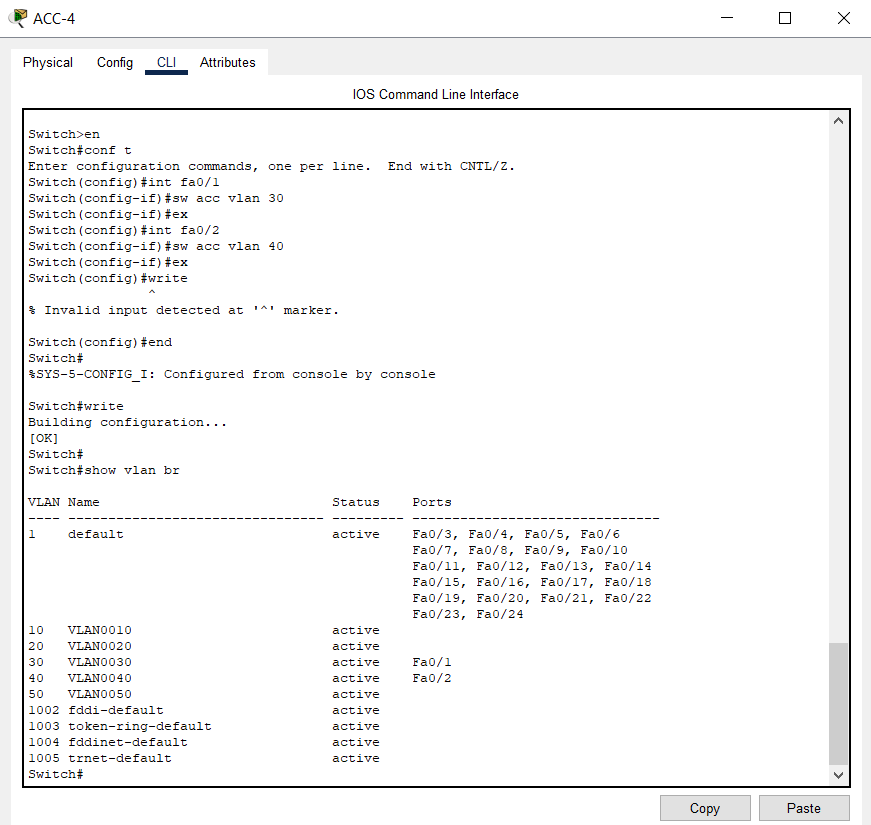
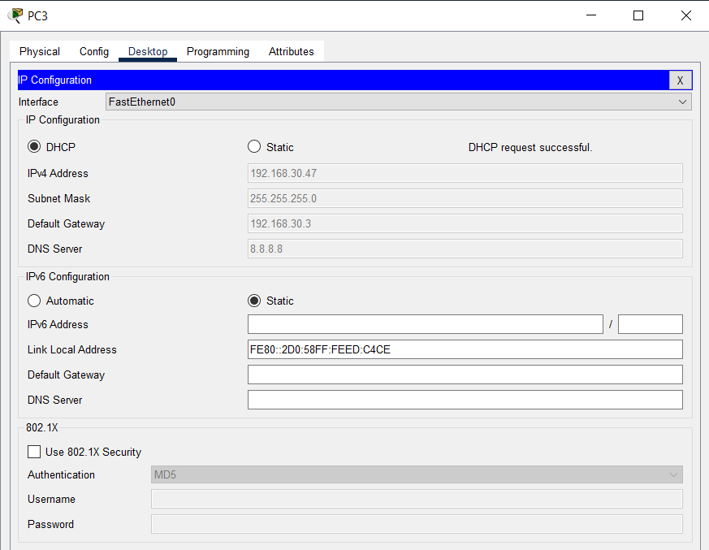
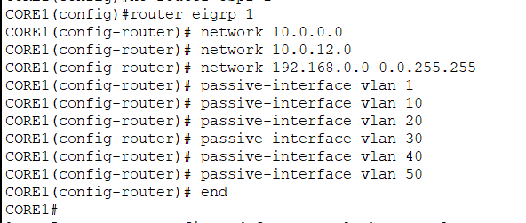

**Mục lục**

- [1. Cấu hình trunk giữa các sw CORE và ACC](#1-cấu-hình-trunk-giữa-các-sw-core-và-acc)
- [2. Cấu hình etherchannel giữa CORE1 và CORE2](#2-cấu-hình-etherchannel-giữa-core1-và-core2)
- [3. Trên CORE1 tạo vlan 10,20,30,40,50. Đồng thời cấu hình VTP với CORE1 là server và các sw khác là client](#3-trên-core1-tạo-vlan-1020304050-đồng-thời-cấu-hình-vtp-với-core1-là-server-và-các-sw-khác-là-client)
- [4. Trên các sw ACC gán các port vào vlan như hình](#4-trên-các-sw-acc-gán-các-port-vào-vlan-như-hình)
- [5. Cấu hình spanning-tree với CORE1 là root-sw cho vlan 10,20,50 và CORE2 là root-sw cho vlan 30,40](#5-cấu-hình-spanning-tree-với-core1-là-root-sw-cho-vlan-102050-và-core2-là-root-sw-cho-vlan-3040)
- [6. Đặt ip cho các vlan trên sw CORE như sau: CORE1 là 192.168.x.1/24 và CORE2 là 192.168.x.2/24](#6-đặt-ip-cho-các-vlan-trên-sw-core-như-sau-core1-là-192168x124-và-core2-là-192168x224)
- [7. Cấu hình HSRP trên sw CORE với vlan 10,20,50 ưu tiên đi CORE1 và vlan 30,40 ưu tiên đi CORE2](#7-cấu-hình-hsrp-trên-sw-core-với-vlan-102050-ưu-tiên-đi-core1-và-vlan-3040-ưu-tiên-đi-core2)
- [8. Cấu hình SERVER làm DHCP server, cấp phát ip cho các VPC với vlan tương ứng](#8-cấu-hình-server-làm-dhcp-server-cấp-phát-ip-cho-các-vpc-với-vlan-tương-ứng)
- [9. Đặt ip cho các R và sw CORE, cấu hình Nat trên R để mạng nội bộ ra được internet (ping đc 8.8.8.8)](#9-đặt-ip-cho-các-r-và-sw-core-cấu-hình-nat-trên-r-để-mạng-nội-bộ-ra-được-internet-ping-đc-8888)
- [10. Nat SERVER ra ngoài internet với địa chỉ public 203.162.1.2 cho dịch vụ web và ftp](#10-nat-server-ra-ngoài-internet-với-địa-chỉ-public-20316212-cho-dịch-vụ-web-và-ftp)
- [11. Cấu hinh dự phòng sao cho 1 trong 2 cổng trên R shutdown thì mọi VPC sẽ tự động định tuyến qua R còn lại và ngược lại](#11-cấu-hinh-dự-phòng-sao-cho-1-trong-2-cổng-trên-r-shutdown-thì-mọi-vpc-sẽ-tự-động-định-tuyến-qua-r-còn-lại-và-ngược-lại)
- [12. Cấu hình load-balancing trên R-Hải Phòng ra Net](#12-cấu-hình-load-balancing-trên-r-hải-phòng-ra-net)
- [13. Cấu hình GRE VPN trên R-Active, R-Backup, R-Chi nhánh để dù 1 R trên trụ sở down thì vẫn vpn vào SERVER bằng R còn lại](#13-cấu-hình-gre-vpn-trên-r-active-r-backup-r-chi-nhánh-để-dù-1-r-trên-trụ-sở-down-thì-vẫn-vpn-vào-server-bằng-r-còn-lại)
- [14. Cấu hình chỉ cho vlan 10 có thể telnet/SSH vào các R và sw CORE](#14-cấu-hình-chỉ-cho-vlan-10-có-thể-telnetssh-vào-các-r-và-sw-core)
- [15. Cấu hình cấm các VPC của chi nhánh vào đc mạng vlan 30 và 40](#15-cấu-hình-cấm-các-vpc-của-chi-nhánh-vào-đc-mạng-vlan-30-và-40)


### 1. Cấu hình trunk giữa các sw CORE và ACC
  - Trên CORE1
    - Cấu hình trunk:
    ```
    Switch(config)#int range g1/0/1
    Switch(config-if-range)#switchport mode trunk
    ```
    
    - Tương tự các cổng còn lại
  
  - Trên CORE2
    - Tương tự CORE1
  
  - Kiểm tra các ACC đã được cấu hình trunk chưa
  
    


### 2. Cấu hình etherchannel giữa CORE1 và CORE2
  - Sử dụng Mode On ép buộc khởi tạo etherchannel 
    ```
    Switch(config)# interface rang g1/0/21 - 22
    Switch(config-if-range)# channel-group 1 mode on
    ```
    
  - Xem kết quả
    > Switch#show etherchannel sumary

  - CORE 1
  
  - CORE 2
  


### 3. Trên CORE1 tạo vlan 10,20,30,40,50. Đồng thời cấu hình VTP với CORE1 là server và các sw khác là client
  - Cấu hình CORE1 làm VTP Server 
    - Thiết lập VTP domain: networks
    - Tạo các vlan
  ```
    Switch(config)#vtp domain networks
    Changing VTP domain name from NULL to networks
    Switch(config)#vtp mode server
    Device mode already VTP SERVER.
    Switch(config)#vlan 10
    Switch(config-vlan)#vlan 20
    Switch(config-vlan)#vlan 30
    Switch(config-vlan)#vlan 40
    Switch(config-vlan)#vlan 50
  ```
    

    
  - Cấu hình các sw khác là client
    - Thiết lập VTP domain: networks
    > Switch(config)#vtp domain networks
Domain name already set to networks.
Switch(config)#vtp mode client
Setting device to VTP CLIENT mode.

    

    


### 4. Trên các sw ACC gán các port vào vlan như hình
  - Gán port vào vlan trên sw ACC3
  ```
    Switch(config)#int fa0/1
    Switch(config-if)#switchport access vlan 10
  ```
  
  
  - ACC-4
    
  - ACC-5
  


### 5. Cấu hình spanning-tree với CORE1 là root-sw cho vlan 10,20,50 và CORE2 là root-sw cho vlan 30,40
  - Sử dụng Rapid Spanning Tree Protocol giúp cải tiến sự hội tụ của STP
  > Switch(config)#spanning-tree mode rapid
  - CORE 1
  ```
    Switch(config)#spanning-tree mode rapid
    Switch(config)#spanning-tree vlan 10 root primary
    Switch(config)#spanning-tree vlan 20 root primary
    Switch(config)#spanning-tree vlan 50 root primary
    Switch(config)#spanning-tree vlan 30 root secondary
    Switch(config)#spanning-tree vlan 40 root secondary
  ```
  
    - Kiểm tra
  

  - CORE 2
  ```
    Switch(config)#spanning-tree mode rapid
    Switch(config)#spanning-tree vlan 10 root secondary
    Switch(config)#spanning-tree vlan 20 root secondary
    Switch(config)#spanning-tree vlan 50 root secondary
    Switch(config)#spanning-tree vlan 30 root primary
    Switch(config)#spanning-tree vlan 40 root primary
  ```
    - Kiểm tra 
  
    - Do dùng spanning-tree mode rapid cho CORE nên cũng cần dùng cho các sw ACC
    
    - Câu lệnh `write` để lưu cấu hình


### 6. Đặt ip cho các vlan trên sw CORE như sau: CORE1 là 192.168.x.1/24 và CORE2 là 192.168.x.2/24
  - CORE1
  ```
    Switch(config)#int vlan 1
    Switch(config-if)#  ip add 192.168.1.1 255.255.255.0
    Switch(config-if)#  no shut
    Switch(config-if)#  ex

    Switch(config)#int vlan 10
    Switch(config-if)#  ip add 192.168.10.1 255.255.255.0
    Switch(config-if)#  no shut
    Switch(config-if)#  ex

    Switch(config)#int vlan 20
    Switch(config-if)#  ip add 192.168.20.1 255.255.255.0
    Switch(config-if)#  no shut
    Switch(config-if)#  ex

    Switch(config)#int vlan 30
    Switch(config-if)#  ip add 192.168.30.1 255.255.255.0
    Switch(config-if)#  no shut
    Switch(config-if)#  ex

    Switch(config)#int vlan 40
    Switch(config-if)#  ip add 192.168.40.1 255.255.255.0
    Switch(config-if)#  no shut
    Switch(config-if)#  ex

    Switch(config)#int vlan 50
    Switch(config-if)#  ip add 192.168.50.1 255.255.255.0
    Switch(config-if)#  no shut
    Switch(config-if)#  ex
  ```
    
  - Kiểm tra ip đã đặt
  ```
  Switch#show ip int brief
  ```
    

  - CORE2
  ```
    Switch(config)#int vlan 1
    Switch(config-if)#  ip add 192.168.1.2 255.255.255.0
    Switch(config-if)#  no shut
    Switch(config-if)#  ex

    Switch(config)#int vlan 10
    Switch(config-if)#  ip add 192.168.10.2 255.255.255.0
    Switch(config-if)#  no shut
    Switch(config-if)#  ex

    Switch(config)#int vlan 20
    Switch(config-if)#  ip add 192.168.20.2 255.255.255.0
    Switch(config-if)#  no shut
    Switch(config-if)#  ex

    Switch(config)#int vlan 30
    Switch(config-if)#  ip add 192.168.30.2 255.255.255.0
    Switch(config-if)#  no shut
    Switch(config-if)#  ex

    Switch(config)#int vlan 40
    Switch(config-if)#  ip add 192.168.40.2 255.255.255.0
    Switch(config-if)#  no shut
    Switch(config-if)#  ex

    Switch(config)#int vlan 50
    Switch(config-if)#  ip add 192.168.50.2 255.255.255.0
    Switch(config-if)#  no shut
    Switch(config-if)#  ex
  ```
    
    - Kiểm tra ip đã đặt trên CORE2
    


### 7. Cấu hình HSRP trên sw CORE với vlan 10,20,50 ưu tiên đi CORE1 và vlan 30,40 ưu tiên đi CORE2
  - Đặt ip ảo Vlan 10 là 192.168.10.3
  - CORE1
  ```
    Switch(config)#int vlan 10
    Switch(config-if)#standby 1 ip 192.168.10.3
    Switch(config-if)#standby 1 priority 105
    Switch(config-if)#standby 1 preempt
    Switch(config-if)#ex

    Switch(config)#int vlan 20
    Switch(config-if)#standby 1 ip 192.168.20.3
    Switch(config-if)#standby 1 priority 105
    Switch(config-if)#standby 1 preempt
    Switch(config-if)#ex

    Switch(config)#int vlan 50
    Switch(config-if)#standby 1 ip 192.168.50.3
    Switch(config-if)#standby 1 priority 105
    Switch(config-if)#standby 1 preempt
    Switch(config-if)#ex 

    Switch(config)#int vlan 30
    Switch(config-if)#standby 1 ip 192.168.30.3
    Switch(config-if)#standby 1 priority 95
    Switch(config-if)#standby 1 preempt
    Switch(config-if)#ex

    Switch(config)#int vlan 40
    Switch(config-if)#standby 1 ip 192.168.40.3
    Switch(config-if)#standby 1 priority 95
    Switch(config-if)#standby 1 preempt
    Switch(config-if)#ex

  ```
  
  - CORE2
  ```
      Switch(config)#int vlan 10
    Switch(config-if)#standby 1 ip 192.168.10.3
    Switch(config-if)#standby 1 priority 95
    Switch(config-if)#standby 1 preempt
    Switch(config-if)#ex

    Switch(config)#int vlan 20
    Switch(config-if)#standby 1 ip 192.168.20.3
    Switch(config-if)#standby 1 priority 95
    Switch(config-if)#standby 1 preempt
    Switch(config-if)#ex

    Switch(config)#int vlan 50
    Switch(config-if)#standby 1 ip 192.168.50.3
    Switch(config-if)#standby 1 priority 95
    Switch(config-if)#standby 1 preempt
    Switch(config-if)#ex 

    Switch(config)#int vlan 30
    Switch(config-if)#standby 1 ip 192.168.30.3
    Switch(config-if)#standby 1 priority 105
    Switch(config-if)#standby 1 preempt
    Switch(config-if)#ex

    Switch(config)#int vlan 40
    Switch(config-if)#standby 1 ip 192.168.40.3
    Switch(config-if)#standby 1 priority 105
    Switch(config-if)#standby 1 preempt
    Switch(config-if)#ex
  ```


### 8. Cấu hình SERVER làm DHCP server, cấp phát ip cho các VPC với vlan tương ứng
  - Cấu hình DHCP server
  
  - Đặt Ip tĩnh
  
  - CORE1
  ```
    Switch(config)#int vlan 10
    Switch(config-if)# ip helper-address 192.168.50.254
    Switch(config-if)# ex
    Switch(config)#int vlan 20
    Switch(config-if)# ip helper-address 192.168.50.254
    Switch(config-if)# ex
    Switch(config)#int vlan 30
    Switch(config-if)# ip helper-address 192.168.50.254
    Switch(config-if)# ex
    Switch(config)#int vlan 40
    Switch(config-if)# ip helper-address 192.168.50.254
    Switch(config-if)# ex
    Switch(config)#int vlan 50
    Switch(config-if)# ip helper-address 192.168.50.254
    Switch(config-if)# ex
  ```
  - CORE2
  ```
    Switch(config)#int vlan 10
    Switch(config-if)# ip helper-address 192.168.50.254
    Switch(config-if)# ex
    Switch(config)#int vlan 20
    Switch(config-if)# ip helper-address 192.168.50.254
    Switch(config-if)# ex
    Switch(config)#int vlan 30
    Switch(config-if)# ip helper-address 192.168.50.254
    Switch(config-if)# ex
    Switch(config)#int vlan 40
    Switch(config-if)# ip helper-address 192.168.50.254
    Switch(config-if)# ex
    Switch(config)#int vlan 50
    Switch(config-if)# ip helper-address 192.168.50.254
    Switch(config-if)# ex
  ```
  - PC1
  
  - PC2
  
  - PC3
  
  - PC4
  

### 9. Đặt ip cho các R và sw CORE, cấu hình Nat trên R để mạng nội bộ ra được internet (ping đc 8.8.8.8)
  - Cấu hình ip cho R1
  ```
  R1(config)#int f0/0
  R1(config-if)# ip add 2.2.2.1 255.255.255.0
  R1(config-if)# no shut
  R1(config-if)# ex

  R1(config)#int f0/1
  R1(config-if)# ip add 1.1.1.1 255.255.255.0
  R1(config-if)# no shut
  R1(config-if)# ex

  R1(config)#int lo0
  R1(config-if)# ip add 8.8.8.8 255.255.255.255
  R1(config-if)# ex
  
  R1(config)#router eigrp 1
  R1(config-router)# network 8.8.8.8 
  R1(config-router)# network 1.1.1.0 
  R1(config-router)# network 2.2.2.0 
  R1(config-router)# ex
  ```
  
  - Cấu hình ip cho R2
  ```
  R2(config)#int f0/0
  R2(config-if)# ip add 2.2.2.2 255.255.255.0
  R2(config-if)# no shut
  R2(config-if)# ex

  R2(config)#int f0/1
  R2(config-if)# ip add 3.3.3.2 255.255.255.0
  R2(config-if)# no shut
  R2(config-if)# ex

  R2(config)#int f1/1
  R2(config-if)# ip add 113.171.3.2 255.255.255.0
  R2(config-if)# no shut
  R2(config-if)# ex

  R2(config)#int f1/0
  R2(config-if)# ip add 113.171.2.2 255.255.255.0
  R2(config-if)# no shut
  R2(config-if)# ex

  R2(config)#router eigrp 1
  R2(config-router)# network 113.171.0.0 
  R2(config-router)# network 2.2.2.0 
  R2(config-router)# network 3.3.3.0 
  R2(config-router)# ex
  ``` 
  
  - Cấu hình ip cho R3
  
  - Cấu hình ip cho R4
  
  - Kiểm tra
    - R1: Đọc được mạng 3.3.3.0 và 4.4.4.0
  
    - R2: Đọc được mạng 1.1.1.0, 2.2.2.0 và 8.8.8.8
  
    - R3: Đọc được mạng 1.1.1.0, 2.2.2.0 và 8.8.8.8
  
    - R4: Đọc được mạng 2.2.2.0, 3.3.3.0 và 8.8.8.8
  
  - Cấu hình ip cho R-Active
  
  - Cấu hình ip cho R-Backup
  
  - CORE1
  
  - CORE2
  
  - CORE1 ping 10.0.0.1 để kiểm tra
  
  - CORE2 ping 10.0.1.1 để kiểm tra 
  
  - Cấu hình định tuyến động cho R-Active
  
  - Cấu hình định tuyến động cho R-Backup
  
  - Cấu hình định tuyến động và đổi port layer 2 (trunk) sang port layer 3 cho CORE1
  
  
  - Cấu hình định tuyến động và đổi port layer 2 (trunk) sang port layer 3 cho CORE2
  
  
  - Thử xóa dây kết nối giữa R-Backup và CORE2 để kiểm tra CORE2 đã chuyển hướng qua CORE1 chưa
  
  - Tiến hành redistribute
    - R-Active
  
    - R-Backup
  
  - Cấu hình NAT 
    - R-Active
  
    - R-Backup
  
  - ping 8.8.8.8 tại PC1
  
  - Từ PC1 đã ping được ra 8.8.8.8 => thành công
### 10. Nat SERVER ra ngoài internet với địa chỉ public 203.162.1.2 cho dịch vụ web và ftp
- Cấu hình NAT
  - R-Active
  
  - R-Backup
  
### 11. Cấu hinh dự phòng sao cho 1 trong 2 cổng trên R shutdown thì mọi VPC sẽ tự động định tuyến qua R còn lại và ngược lại

### 12. Cấu hình load-balancing trên R-Hải Phòng ra Net

### 13. Cấu hình GRE VPN trên R-Active, R-Backup, R-Chi nhánh để dù 1 R trên trụ sở down thì vẫn vpn vào SERVER bằng R còn lại

### 14. Cấu hình chỉ cho vlan 10 có thể telnet/SSH vào các R và sw CORE

### 15. Cấu hình cấm các VPC của chi nhánh vào đc mạng vlan 30 và 40
