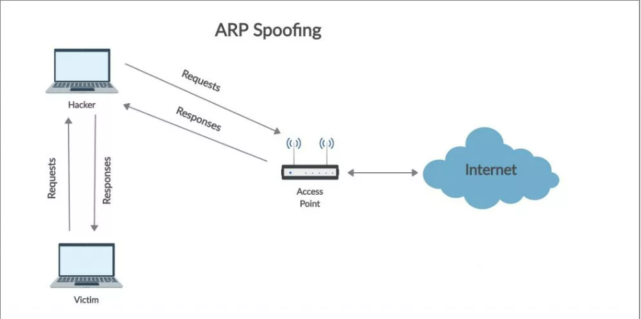
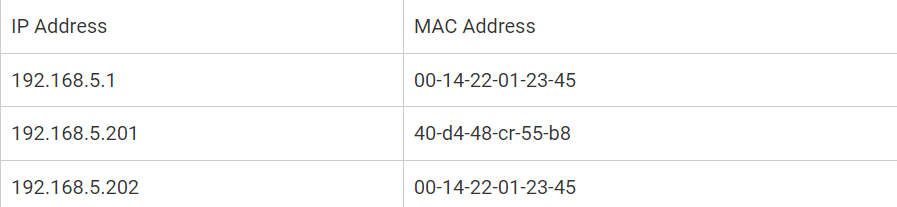
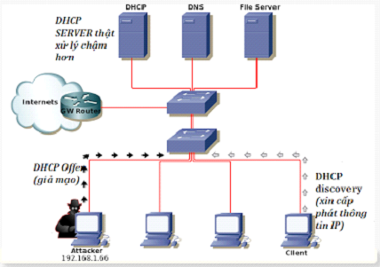

- [Bảo mật trong mạng LAN: tấn công ARP Spoofing, MAC Spoofing, DHCP Spoofing và cách phòng tránh](#bảo-mật-trong-mạng-lan-tấn-công-arp-spoofing-mac-spoofing-dhcp-spoofing-và-cách-phòng-tránh)
  - [1.ARP Spoofing](#1arp-spoofing)
  - [2. MAC Spoofing](#2-mac-spoofing)
  - [3. DHCP Spoofing](#3-dhcp-spoofing)

## Bảo mật trong mạng LAN: tấn công ARP Spoofing, MAC Spoofing, DHCP Spoofing và cách phòng tránh
### 1.ARP Spoofing
- ARP (Address Resolution Protocol) chuyển địa chỉ IP sang địa chỉ MAC (Media Access Control) và ngược lại
- ARP Spoofing là 1 cuộc tấn công MitM cho phép những kẻ tấn công chặn giao tiếp giữa các thiết bị mạng
- Quá trình tấn công
  
    - Kẻ tấn công có quyền truy cập vào mạng. Chúng quét mạng để xác định địa chỉ IP của ít nhất 2 thiết bị
    - Kẻ tấn công sử dụng 1 công cụ giả mạo để gửi phản hồi ARP giả mạo
    - Các phản hồi giả mạo thông báo rằng địa chỉ MAC của kẻ tấn công là địa chỉ MAC chính xác --> 2 thiết bị sẽ kết nối với máy của kẻ tấn công thay vì kết nối với nhau
    - Khi các thiết bị giao tiếp với nhau thay vì trực tiếp với nhau, kẻ tấn công có thể:
      - Đánh cắp dữ liệu, ngoại trừ gói tin được truyền qua kênh truyền được mã hóa như HTTPS
      - Chiếm quyền điều khiển session, kẻ tấn công có thể có quyền truy cập vào tài khoản người dùng hiện đang đăng nhập qua session ID
      - Thay đổi giao tiếp, đấy file hoặc web độc hại đến máy tính
- Cách phát hiện tấn công ARP spoofing
  - Trên command line, sử dụng lệnh
    > arp -n
    - Nếu kết quả trả về chứa 2 địa chỉ IP khác nhau có cùng địa chỉ MAC, chứng tỏ có 1 cuộc tấn công ARP đnag diễn ra
    - Ví dụ:
  
  - ARP Spoofing Detection Tool: Một số công cụ phát hiện ARP Spoofing có thể giúp phát hiện sự thay đổi không mong muốn trong bảng ARP của các thiết bị mạng
  - Có thể sử dụng phần mềm Wireshark để bắt và phân tích gói tin có thể phát hiện ARP spoofing trong một mạng lớn và biết thêm thông tin về loại giao tiếp mà kẻ tấn công thực hiện
- Cách phòng chống ARP spoofing
  - Sử dụng Mạng riêng ảo (Virtual Private Network - VPN): cho phép các thiết bị kết nối với internet thông qua 1 tunnel được mã hóa làm cho tất cả thông tin liên lạc được mã hóa
  - Sử dụng ARP tĩnh: sẽ giữ cho các bản ghi ARP cố định và không thay đổi khi có các ARP Reply không phù hợp.
  - Cập nhật Firmware và Phần mềm: Luôn đảm bảo cập nhật firmware và phần mềm của các thiết bị mạng lên phiên bản mới nhất.
  - Sử dụng Packet filtering: Có thể xác định các gói ARP bị nhiễm độc và ngăn lại
### 2. MAC Spoofing
- MAC Spoofing là một kỹ thuật tấn công mạng trong đó kẻ tấn công thay đổi địa chỉ MAC trong gói tin dữu liệu để giả mạo danh tính của một thiết bị mạng khác 
- Kẻ tấn công thay đổi địa chỉ MAC nguồn trong gói tin thành địa chỉ MAC giả mạo để lừa đảo, truy cập vào hoặc kiểm soát lưu lượng
- MAC Spoofing có thể xảy ra ở bất kỳ đâu có mạng máy tính, bao gồm mạng nội bộ, mạng công cộng, mạng không dây, và internet.
- Cách phát hiện MAC Spoofing
  - ARP Spoofing Detection Tool: Có thể giúp phát hiện sự giả mạo địa chỉ MAC
  - Kiểm tra sự trùng lặp địa chỉ MAC và địa chỉ IP
  - Theo dõi và quản lý các sự kiện mạng có thể phát hiện các hoạt động bất thường
- Cách ngăn chặn 
  - Vô hiệu hóa các dịch vụ và các cổng không sử dụng, đảm bảo mạng không thể truy cập được thông qua bất kỳ cổng không cần thiết nào
  - Sử dụng tường lửa hỗ trợ bảo vệ an ninh cho mạng bằng cách cho phép kiểm soát nhiều hơn đối với các loại dữ liệu có thể được gửi qua mạng và ngăn chặn
  - Sử dụng phương thức xác thực mạnh hơn, luôn đảm bảo cập nhật phiên bản mới nhất của các phần mềm  thiết bị mạng 
  - Dynamic ARP Inspection (DAI): DAI có thể giúp kiểm tra và chặn các gói tin ARP giả mạo trong mạng
### 3. DHCP Spoofing
- `DHCP Spoofing` là kỹ thuật giả mạo DHCP server trong mạng LAN
- Kẻ tấn công có thể cấp phát địa chỉ IP cho nạn nhân với các thông số giả mạo như default gateway, DNS. Qua đó máy tính nạn nhân sẽ bị chuyển hướng truy cập theo ý đồ kẻ tấn công
- Sau khi nhận địa chỉ IP từ DHCP Server giả mạo, có thể sẽ bị chuyển hướng truy cập tới những website kẻ tấn công kiểm soát nhằm đánh cắp thông tin cá nhân của nạn nhân
- Cách thức tấn công
  
  - Kẻ tấn công sẽ liên tục gửi các yêu cầu xin cấp phát IP (DHCP Discover) tới máy DHCP Server. Mỗi yêu cầu sẽ chứa các địa chỉ MAC giả mạo nhằm đánh lừa server rằng đó là lời yêu cầu từ các máy tính khác nhau. Vì IP cấp phát trên Server là hữu hạn nên khi đã cấp phát hết IP, Server sẽ không thể tiếp tục yêu cầu từ máy Client
  - Kẻ tấn công cài đặt phần mềm DHCP Server trên máy tính của mình và cấp phát thông số IP giả, điều hướng truy cập của nạn nhân đến các Server do kẻ tấn công kiểm soát nhằm đánh lừa và đánh cắp thông tin
- Cách ngăn chặn DHCP Spoofing
  - Cấu hình IP Source Guard trên các cổng switch: để đảm bảo rằng chỉ có IP đáng tin cậy mới được phép gửi các gói tin DHCP vào mạng LAN
  - Sử dụng định tuyến VLAN để giới hạn phạm vi truyền tin và đảm bảo rằng các gói tin DHCP chỉ được chuyển qua các cổng switch có kết nối đến máy chủ DHCP
  - Sử dụng DHCP Snooping để theo dõi và xác thực các gói tin DHCP
  - Đảm bảo cập nhật phiên bản mới nhất của các phần mềm  thiết bị mạng 
  - Phân quyền người dùng: Chỉ cấp phép cho những người dùng có đủ đặc quyền để quản lý mạng và hạn chế quyền truy cập của người dùng trong mạng
  

