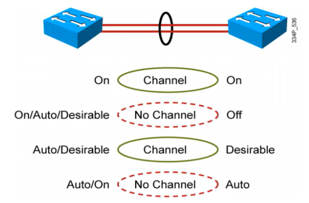
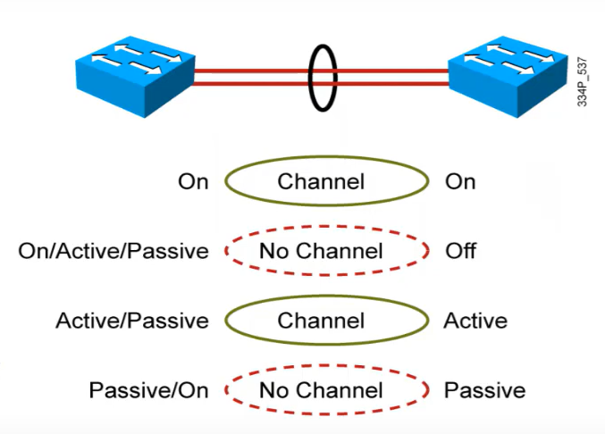
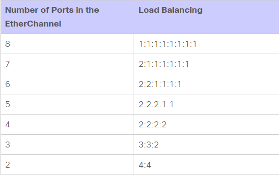

- [EtherChannel(LACP)](#etherchannellacp)
  - [1. Khái niệm](#1-khái-niệm)
  - [2. Điều kiện cấu hình EtherChannel](#2-điều-kiện-cấu-hình-etherchannel)
  - [3. Phân loại Etherchannel](#3-phân-loại-etherchannel)
  - [4. Load balancing trên Etherchannel](#4-load-balancing-trên-etherchannel)


## EtherChannel(LACP)
### 1. Khái niệm  
- EtherChannel là một kỹ thuật nhóm hai hay nhiều đường kết nối truyền tải dữ liệu vật lý (Link Aggregation) thành một đường ảo duy nhất (Logic) có Port ảo thậm chí cả MAC ảo nhằm tăng tốc độ truyền dữ và khả năng dự phòng (Redundancy) cho hệ thống
- Mỗi bó có thể bao gồm từ 2 đến 8 kết nối FE, GE thành 1 link logical 
- Switch hoặc thiết bị ở 2 đầu EtherChannel phải hiểu và sử dụng công nghệ EtherChannel để đảm bảo hoạt động đúng và chống loop. Nếu chỉ có 1 đầu sử dụng, còn đầu bên kia không sử dụng thì có thể gây ra loop
- Nếu một trong các link thuộc EtherChannel bị dơn thì traffic sẽ tự động được chuyển sang link khác trong channel chỉ trong vài miliseconds. Khi link up trở lại thì traffic được phân bố lại như cũ
### 2. Điều kiện cấu hình EtherChannel
- Các Switch phải đều phải hỗ trợ kỹ thuật EtherChannel và phải được cấu hình EtherChannel đồng nhất giữa các Port kết nối với nhau.
- Các Port kết nối EtherChannel giữa 2 Switch phải tương đồng với nhau:
  - Cấu hình (Configuration)
  - Tốc độ (Speed)
  - Băng thông (Bandwidth)
### 3. Phân loại Etherchannel 
- PAgP 
  - Là giao thức độc quyền của Cisco và chỉ hỗ trợ ghép tối đa 8 Link vật lý thành một Link luận lý.
  - PAgP hoạt động ở các mode sau:
    - `ON`: Cho phép thiết lập Channel mà không cần sử dụng giao thức
    - `DESIRABLE`: Chủ động gửi, nhận PAgP message
    - `AUTO`: Bị động, chỉ chờ và nhận PAgP message
    - `OFF`: Không cho phép tạo EtherChannel
  

- LACP (Link Aggregation Control Protocol)
  - Là giao thức cấu hình EtherChannel chuẩn quốc tế IEEE802.3ad và có thể dùng cho tất cả các thiết bị của các hãng, LACP hỗ trợ ghép tối đa 16 link vật lý thành một link luận lý (8 Port Active - 8 Port Passive)
  - LACP hoạt động ở các mode sau:
    - `ON`: Cho phép thiết lập Channel mà không cần sử dụng giao thức
    - `ACTIVE`: Chủ động gửi, nhận LACP message
    - `PASSIVE`: Bị động, chỉ chờ và nhận LACP message
    - `OFF`: Không cho phép tạo EtherChannel
  
### 4. Load balancing trên Etherchannel
- Switch lựa chọn đường link nào trong EtherChannel để forward frame dựa vào kết quả của thuật toán hash. Thuật toán này có thể sử dụng source IP, destination IP (hoặc cả hai), source MAC, destination MAC (hoặc cả hai), TCP/UDP port number. Thuật toán hash sẽ cho ra một chuỗi số nhị phân (0 & 1).
- Nếu chỉ có source hoặc destination được hash (IP, MAC, port number) thì switch sẽ sử dụng một hoặc nhiều low-oder bits của giá trị hash để làm index lựa chọn link trong EtherChannel. Nếu cả source và destination được hash, switch sẽ thực hiện phép toán exclusive-OR (XOR) trên một hoặc nhiều low-order bits để làm index.
  ```
  Ví dụ: 
  Nếu kết quả phép toán hash bằng 0, link 0 được dùng
  Nếu kết quả bằng 1, link 1 được dùng. 
  Nếu một bundle dùng 4 kết nối, thuật toán hash sẽ dùng 2 bit cuối. 
  Tương tự, một bundle có 8 kết nối sẽ dùng một thuật toán has trên 3 bit cuối.
  ```
- Phân loại EtherChannel Load Balancing
  - `dst-ip`(Dst IP Addr): Các gói tin có cùng IP đích sẽ qua 1 đường
  - `dst-mac`(Dst Mac Addr): Các gói tin có cùng MAC đích sẽ qua 1 đường
  - `src-dst-ip`(Src XOR Dst IP Addr)
  - `src-dst-mac`(Src XOR Dst MAC Addr)
  - `src-ip`(Src IP Addr): Các gói tin có cùng src IP sẽ đi qua 1 đường
  - `src-mac`(Src MAC Addr): Các gói tin có cùng src MAC sẽ đi qua 1 đường
- Nếu trong mạng đang chạy bình thường thì nên để nguyên chế độ Load Balancing mặc định của switch tùy model
- Bảng giá trị Load Balancing:
  