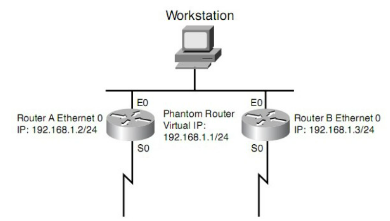

### HSRP, VRRP, GLBP
## 1. HSRP
- Hot Standby Router Protocol (HSRP) - Giao thức định tuyến đường dự phòng nóng, là một giao thức định tuyến đường dự phòng nóng được sử dụng trong mạng máy tính để tạo ra một định tuyến dự phòng cho các thiết bị định tuyến
- HSRP cho phép tạo một đường dự phòng có sẵn để chuyển tiếp lưu lượng mạng nếu thiết bị định tuyến chính gặp sự cố hoặc ngừng hoạt động, giúp tăng tính sẵn sàng và đáng tin cậy của mạng
- Cách thức hoạt động của HSRP:
  - HSRP hoạt động bằng cách tạo ra một router ảo có địa chỉ IP và địa chỉ MAC riêng. Các máy trạm sử dụng địa chỉ IP ảo như một default router. Router HSRP trên một giao tiếp mạng LAN có vai trò chỉ định hai router, một ở chế độ hoạt động và một chế độ chờ
  - Các router ở chế độ hoạt động gửi bản tin Hello định kỳ. Các router HSRP khác lắng nghe các bản tin Hello. Nếu các Router active bị lỗi và các router HSRP khác ngừng nhận bản tin Hello, các Router dự phòng sẽ tiếp nhận và trở thành các Router active
  - HSRP làm việc dựa trên ARP. Khi Router HSRP chế độ active nhận được một yêu cầu ARP cho một nút mạng không cùng mạng LAN, router trả lời với địa chỉ MAC của Router ảo thay vì địa chỉ MAC riêng của nó. Nếu các router gửi trả lời ARP ban đầu bị mất kết nối thì các Active Router vẫn có thể cung cấp lưu lượng truy cập 
  
  - Máy trạm được cấu hình để sử dụng Router ảo (192.168.1.1) như default router
  - Khi khởi động, các Router bầu chọn Router A là HSRP active router, Router B là router HSRP dự phòng
  - Khi máy trạm gửi một frame ARP để tìm kiếm default router, Router A hồi đáp với địa chỉ MAC của router ảo
  - Nếu Router A mất kết nối, Router B sẽ trở thành active router và tiếp tục phân phối các gói tin của máy trạm. Sự thay đổi này được quảng bá cho các máy trạm

- Ưu điểm của HSRP
  - HSRP cung cấp tính sẵn sàng cao cho mạng bằng cách tạo một đường dự phòng nhanh chóng khi router chính gặp sự cố
  - HSRP cho phép chia sẻ tải giữa các router active và standby, giúp tối ưu hóa việc sử dụng tài nguyên mạng
  - HSRP không yêu cầu cấu hình phức tạp và dễ dàng triển khai trong mạng
- Nhược điểm của HSRP
  - Trong một số trường hợp, quá trình chuyển đổi từ router active sang router standby có thể mất một khoảng thời gian nhất định, khiến mạng gặp gián đoạn
  - Phụ thuộc vào giao thức định tuyến: HSRP hoạt động dựa trên giao thức định tuyến như OSPFhoặc EIGRP. Nếu giao thức định tuyến gặp vấn đề, HSRP có thể không hoạt động hiệu quả
## 2. VRRP
- *Virtual Router Redundancy Protocol (VRRP)* là một giao thức định tuyến dự phòng định hướng cho các mạng máy tính, giúp tạo ra một định tuyến dự phòng giữa các thiết bị định tuyến
- VRRP cho phép sử dụng chung 1 địa chỉ IP gateway cho một nhóm router. Nếu router chính gặp sự cố hoặc ngừng hoạt động, ngay lập tức các con router khác sẽ biết và với một số các nguyên tắc bầu chọn do VRRP quy định, các con còn lại sẽ chọn ra 1 con chính khác nắm giữ địa chỉ IP gateway đã được cấu hình từ trước, và lưu lượng từ người dùng sẽ đi qua con gateway mới này => Đảm bảo dịch vụ của người sử dụng thông suốt, không bị gián đoạn
- Các trạng thái của một VRRP Router
  - `Initialize `: Router đã được cấu hình VRRP nhưng chưa bật chức năng này lên. Do đó, router không có khả năng xử lý các gói tin VRRP. Khi người quản trị tạo một sự kiện Startup (dựa vào câu lệnh enable), VRRP sẽ chuyển sang trạng thái Backup
  - `Backup`: Khi ở trạng thái này, VRRP Router có nhiệm vụ chính là giám sát hoạt động của Master Router để phát hiện khi nào con master này gặp sự cố. Nếu gặp sự cố, dựa vào quá trình hoạt động của VRRP, nếu đủ điều kiện, con Backup Router này sẽ nhảy lên làm Master Router. Khi ở trạng thái Backup, router sẽ chỉ nhận các gói tin Advertisement từ Master Router chứ không tham gia vào việc làm gateway trung chuyển gói tin từ các host gửi đến VRRP
  - `Master`: Khi router ở trạng thái này, nó sẽ định kỳ gửi các gói tin Advertisement theo chu kỳ của Advertisement timer. Master Router sẽ đóng vài trò là một con router với MAC là virtual-MAC, IP là virtual-IP. Mọi gói tin gửi đến địa chỉ virtual-MAC hay virtual-IP đều được con Master Router này xử lý
- Các timer cho VRRP
  - *Advertisement Interval (s)*: Chu kỳ gửi gói tin Advertisement => Bộ định thời Advertisement Timer sẽ được kích hoạt mỗi khi router gửi/nhận một bản tin Advertisement
  - *Skew time (s)*: Sử dụng để tính toán Master Down Interval theo priority
    > Skew_time = ((256 – priority) / 256)
  - *Master Down Interval (s)*: Khoảng thời gian để Backup Router nhận ra Master Router gặp sự cố. Hiểu nôm na là cứ 3 lần không nhận được bản tin Advertisement, Backup router sẽ kích hoạt Skew Timer. Skew timer chạy hết mà vẫn không nhận được Advertisement, nó sẽ coi Master bị ngưng hoạt động và bắt đầu quá trình bầu chọn lại Master
    > Master_down_interval = 3 * Advertisement_interval + Skew_time 
- Cách thức hoạt động của VRRP
  - Các VRRP Router trong cùng một VRRP Group tiến hành bầu chọn Master sử dụng giá trị priority đã cấu hình cho router đó. Priority có giá trị từ 0 đến 255. Nguyên tắc cơ bản: Priority cao nhất thì nó là Master, nếu priority bằng nhau thì IP cao hơn là Master
  - Sau khi bầu chọn xong Master, Master Router sẽ gửi trả lời bản tin ARP Request cho host sử dụng Virtual MAC
  - Master Router định kỳ gửi các bản tin Advertisement cho tất cả Virtual Router Backup để thông báo về trạng thái hoạt động của mình. Backup dựa vào các bộ timer của mình để xác định Master có gặp sự cố hay không. Nếu có sự cố, các VRRP Router còn lại trong VRRP Group sẽ tiến hành bầu chọn lại VRRP Master Router theo thứ tự như trên
  - Nếu Master gặp sự cố (gọi là Router A), xong Backup router khác lên thay (gọi là Router B). Khi Router A hoạt động trở lại, nếu Router A có Primary IP = Physical IP, hoặc được cấu hình bật preempt mode => Nó sẽ được khôi phục làm Master. Nếu không, nó sẽ giữ ở trạng thái Backup và khôi phục lại Priority cũ
- Ưu điểm của VRRP
  - Tăng tính sẵn sàng và đáng tin cậy bằng cách tạo một đường dự phòng nhanh chóng khi router chính gặp sự cố
  - VRRP cho phép chia sẻ tải giữa các router active và standby, giúp tối ưu hóa việc sử dụng tài nguyên mạng
  - VRRP không yêu cầu cấu hình phức tạp và dễ dàng triển khai trong mạng
  - VRRP cho phép mở rộng hệ thống dự phòng bằng cách thêm các router standby vào cụm VRRP
- Nhược điểm của VRRP
  - Trong một số trường hợp, quá trình chuyển đổi từ router active sang router standby có thể mất một khoảng thời gian nhất định, khiến mạng gặp gián đoạn
  - Phụ thuộc vào giao thức định tuyến: VRRP hoạt động dựa trên giao thức định tuyến như OSPF (Open Shortest Path First) hoặc EIGRP (Enhanced Interior Gateway Routing Protocol). Nếu giao thức định tuyến gặp vấn đề, VRRP có thể không hoạt động hiệu quả
## 3. GLRP
- *Gateway Load Balancing Protocol (GLBP)* - Giao thức cân bằng tải cổng vào cổng, là một giao thức cân bằng tải cổng vào cổng được sử dụng trong mạng máy tính để tăng tính sẵn sàng và hiệu suất truy cập vào cổng mặc định của mạng
- GLBP cho phép nhiều router làm việc cùng nhau như một cụm để cân bằng tải các yêu cầu từ các thiết bị kết nối vào mạng
- Cách thức hoạt động của GLRP
  - Trong GLBP, một nhóm các router được cấu hình để hoạt động cùng nhau như một cụm (group) GLBP. Mỗi cụm GLBP bao gồm một router active (hoạt động) và các router standby (dự phòng). Router active sẽ phân phối địa chỉ IP ảo (Virtual IP address) cho các router standby trong cụm.
  - Các thiết bị kết nối trong mạng sẽ gửi yêu cầu ARP (Address Resolution Protocol) đến địa chỉ IP ảo để tìm router mặc định
  - Khi router active nhận được yêu cầu ARP, nó sẽ phản hồi với địa chỉ MAC của chính nó. Tuy nhiên, nó sẽ cũng cấp địa chỉ MAC của một trong các router standby cho các yêu cầu ARP sau này
  - Các thiết bị kết nối trong mạng sẽ cân bằng tải truy cập vào router mặc định bằng cách sử dụng các địa chỉ MAC của các router standby. Nếu router active gặp sự cố hoặc ngừng hoạt động, một trong các router standby sẽ được chọn làm router active và tiếp tục cung cấp các địa chỉ MAC cho các yêu cầu ARP
- Ưu điểm của GLBP
  - Tăng tính sẵn sàng và đáng tin cậy bằng cách tạo một đường dự phòng nhanh chóng khi router chính gặp sự cố
  - GLBP cân bằng tải truy cập vào router mặc định bằng cách sử dụng các địa chỉ MAC của các router standby, giúp tối ưu hóa việc sử dụng tài nguyên mạng
  - GLBP cho phép mở rộng hệ thống dự phòng bằng cách thêm các router standby vào cụm GLBP.

- Nhược điểm của GLRP
  - Cấu hình và triển khai GLBP có thể phức tạp và đòi hỏi kiến thức về định tuyến và bảo mật mạng
  - Phụ thuộc vào giao thức định tuyến: GLBP hoạt động dựa trên giao thức định tuyến như OSPF (Open Shortest Path First) hoặc EIGRP (Enhanced Interior Gateway Routing Protocol). Nếu giao thức định tuyến gặp vấn đề, GLBP có thể không hoạt động hiệu quả