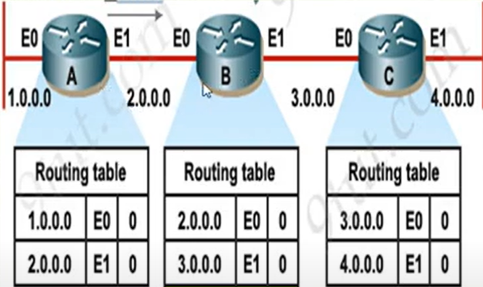
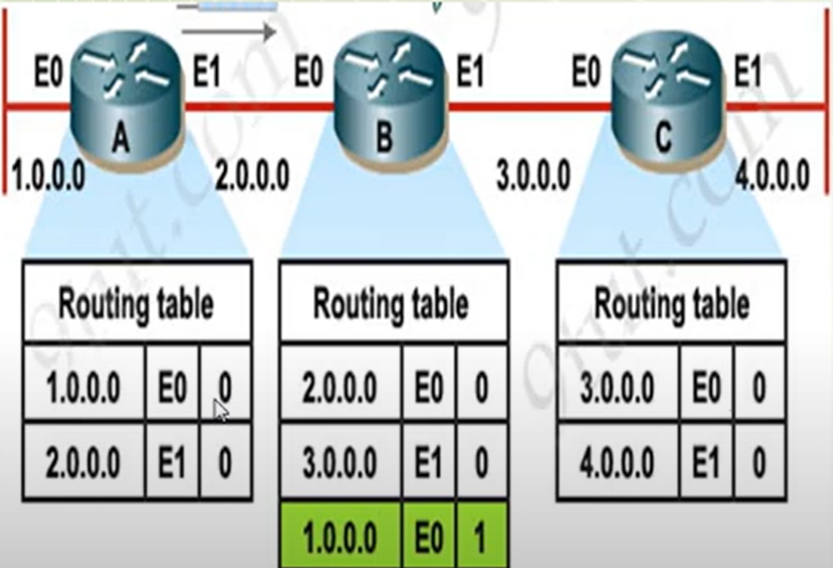
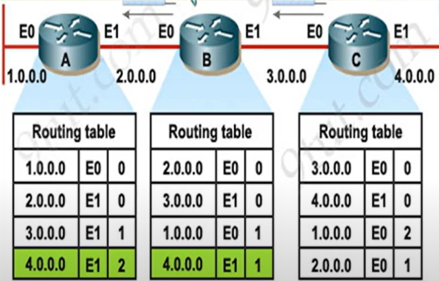

- [Kiến thức về layer 3 router, Định tuyến và các giao thức định tuyến (RIP, EIGRP,OSPF, BGP). So sánh RIP, EIGRP, OSPF](#kiến-thức-về-layer-3-router-định-tuyến-và-các-giao-thức-định-tuyến-rip-eigrpospf-bgp-so-sánh-rip-eigrp-ospf)
  - [1. Layer 3 router](#1-layer-3-router)
  - [2. Định tuyến và các giao thức định tuyến](#2-định-tuyến-và-các-giao-thức-định-tuyến)
    - [2.1 RIP](#21-rip)
    - [2.2 EIGRP](#22-eigrp)
    - [2.3 OSPF](#23-ospf)
    - [2.4 BGP](#24-bgp)
  - [3. So sánh RIP, EIGRP, OSPF](#3-so-sánh-rip-eigrp-ospf)

## Kiến thức về layer 3 router, Định tuyến và các giao thức định tuyến (RIP, EIGRP,OSPF, BGP). So sánh RIP, EIGRP, OSPF
### 1. Layer 3 router
### 2. Định tuyến và các giao thức định tuyến
- Định tuyến gồm: Định tuyến tĩnh và định tuyến động
  - Định tuyến tĩnh: phù hợp các mạng cỡ nhỏ ( dưới 15 route)
  - Định tuyến động: 
    - Các giao thức định tuyến sẽ được cấu hình trên các router, từ đó tự động xây dựng các bảng định tuyến dành cho nó
    - Các giao thức định tuyến
      - `Distance Vector`: vector khoảng cách, điển hình là giao thức `RIP`
      - `Link-state`: Trạng thái đường link, điển hình là giao thức `OSPF`
      - `Hybrid`: điển hình là giao thức `EIGRP`
    - Phân loại giao thức định tuyến động

    | IGP  | EGP  |
    |---|---|
    | Interior Gateway Protocol  | Exterior Gateway Protocol  |
    | Được sử dụng trong một AS  | Được sử dụng giữa các AS  |
    | Các giao thức: RIP, EIGRP, OSPF  | Giao thức: BGP  |

- Administrative Distance (AD)
  - Là chỉ số tin cậy của thông tin định tuyếnkhi các router trao đổi với nhau 
  - Giá trị từ 0 đến 255, giá trị càng nhỏ thì độ tin cậy càng lớn
- Autonomous System (AS)
  - Là tập hợp các router dưới quyền quản trị của 1 tổ chức, doanh nghiệp và có chung một chính sách định tuyến.
  - Mỗi AS được định danh bằng một giá trị, gọi là Autonomous System Number (ASN) có chiều dài 16 bit
  - ASN có giá trị từ 1 – 65535
    - Public AS : 1 – 64512.
    - Private AS : 64513 – 65535.

#### 2.1 RIP
- `RIP` (Routing Information Protocol) là giao thức thông tin định tuyến thuộc loại giao thức định tuyến khoảng cách véctơ (Distance Vector)
- Sử dụng giao thức UDP port 520
- RIP hỗ trợ
  - Classless (RIPv2) : Có gửi kèm subnet mask trong bản tin định tuyến
  - Classfull (RIPv1) : Không gửi đính kèm subnet mask trong bản tin định tuyến
- RIP có AD là 120, Metric: hop-count (số chặng), qua 1 router là 1 hop-count
- Nguyên lý hoạt động
  - Mỗi router trong mạng khi chạy giao thức RIP định kỳ 30s/lần sẽ quảng bá bảng định tuyến của nó cho các router láng giềng
  
  - Khi nhận được bảng định tuyến của router A thì B sẽ kiểm tra trong bảng định tuyến của nó xem các tuyến của A quảng bá sang đã có trong bảng định tuyến của B chưa, nếu chưa có thì B sẽ cập nhật tuyến đó vào bảng định tuyến của B
  
  - Các router sẽ quảng bá đi quảng bá lại
  
- RIP Timers
  - `Update timer` (Thời gian để gửi bản tin update thồng tin): 30s, là thời gian cho phép các router gửi bản tin update sang router hàng xóm để cập nhật thông tin
  - `Invalid timer` (thời gian không hợp lệ): 180s, là thời gian cho phép router chờ đợi bản tin update. Thông tin update nếu không được phản hồi trong thời gian này, toàn bộ các tuyến đường update sẽ không được xác định và loại bỏ
  - Flush timer: 240s, là thời gian mà trước khi các tuyến đường không hợp lệ sẽ bị xóa bỏ khỏi thông tin bảng định tuyến
  - Hold Down timer: 180s, là khoảng thời gian được tính từ khi router nhận được thông tin một router là *unreachable* (không thế truy cập)
- So sánh RIPv1 và RIPv2
  | RIPv1  | RIPv2  |
  |---|---|
  | Giao thức Classfull | Giao thức Classless  |
  | Không có cơ chế xác thực | Hỗ trợ cơ chế xác thực  |
  | Sử dụng bản tin broadcast để cập nhật: 255.255.255.255 | Sử dụng địa chỉ multicast: 244.0.0.9  |
- Ưu, nhược điểm của giao thức RIP
  - Ưu điểm
    - Dễ triển khai
    - Không hạn chế khả năng thiết kế 
    - Sử dụng ít tài nguyên hệ thống
  - Nhược điểm
    - Tiêu tốn lớn băng thông trong quá trình gửi bản tin Broadcast mỗi 30s/lần 
    - Hoạt động dựa trên giá trị Hop-count
    - Không có khả năng mở rộng vì giá trị cao nhất của Hop-count là 15
    - Hội tụ mạng chậm

#### 2.2 EIGRP
- `EIGRP` (Enhanced Interior Gateway Routing Protocol) là giao thức nâng cao của Distance Vector, là giao thức tiêu chuẩn chỉ sử dụng cho các thiết bị của Cisco
- Khả năng hội tụ nhanh
- Hỗ trợ định tuyến Classless 100% chống loop
- Hop count tối đa là 255, AD = 90
- Gửi các cập nhật định tuyến khi có sự thay đổi xảy ra trong mạng, đến các router cần thiết
- Có khả năng cân bằng tải qua các đường không đều nhau, phân tán ra các đường thay vì lưu lượng tập trung nhiều vào 1 cổng,đường truyền
- Dễ dàng cấu hình cho hệ thống mạng LAN và WAN
- Không dùng địa chỉ Broadcast mà chỉ dùng địa chỉ Multicast và Unicast (224.0.0.10)
- Bản tin Hello gửi định kỳ 5s/lần
- Các bảng lưu trữ thông tin
  - *Neighbor Table*:
    - Lưu trữ thông tin các router láng giềng kết nối trực tiếp
    - Câu lệnh kiểm tra
      > show ip eigrp neighbor
  - *Topology table*: 
    - Lưu trữ thông tin định tuyến học được từ các bảng định tuyến của các láng giềng
    - Câu lệnh kiểm tra
      > show ip eigrp topology
  - *Routing table*:
    - Lưu trữ thông tin về các đường đi tốt nhất đến các mạng, sử dụng thuật toán DUAL (Diffusion Update Alorithm) để tính toán đường đi tốt nhẩt
    - Câu lệnh kiểm tra
      > show ip route
- Chỉ số Metric của EIGRP
  - Metric của EIGRP bao gồm 5 chỉ số :
    - Bandwidth (BW) – băng thông.
    - Delay – độ trễ.
    - Load – khả năng truyền tải.
    - Max Tranfers Unit (MTU) – đơn vị lớn nhất gói tin có thể truyền đi là 1500 byte.
    - Reliability – độ tin cậy.
  - Mặc định sẽ sử dụng giá trị của Bandwidth và Delay để tính chỉ số Metric .
  - Công thức tính chỉ số Metric khi giá trị K là mặc định : (K1 = 1, K2 = 0, K3 = 1, K4 = 0 và K5 = 0).
Metric = 𝐾1 ∗ 𝑏𝑎𝑛𝑑𝑤𝑖𝑑𝑡ℎ + ((𝐾2 ∗ 𝑏𝑎𝑛𝑑𝑤𝑖𝑑𝑡ℎ) / (256 - load)) + 𝐾3 ∗ 𝐷𝑒𝑙𝑎𝑦

#### 2.3 OSPF
- `OSPF` (Open Shortest Path First) được phát triển bởi Internet Engineerong Task Force (IETF) như một sự thay thế những nhược điểm và hạn chế của RIP
- Là một giao thức trạng thái đường link (Link state protocol), là giao thức định tuyến classless
- Không giới hạn số lượng *Hop count* trong mạng
- Có AD = 110, Metric là cost = 10^8/BW
- Các gói tin Hello được gửi mỗi 10s/lần (Hello Intervals), Dead Intervals = 40s
- OSPF được chia thành các vùng (Area) để dễ dàng cho việc quản lý và kiểm soát lưu lượng
- Router-ID 
  - Là giá trị định danh cho 1 router khi tham gia vào miền OSPF
  - Nếu các interface loopback được cấu hình trên router, thì địa chỉ IP cao nhất trong các IP này sẽ được sử dụng làm Router-ID
  - Nếu các interface loopback không được cấu hình, thì địa chỉ IP cao nhất của các interface vật lý đang active sẽ được sử dụng làm router-ID
- Các bảng lưu trữ thông tin của OSPF
  - *Neighbor Tables*:
    - Được biết như là cơ sở dữ liệu liền kề
    - Lưu danh sách các router láng giềng
    - Câu lệnh kiểm tra
      > show ip ospf neighbor
  - *Database Table*
    - Thường được gọi là Link state database (LSDB)
    - Lưu thông tin của tất cả tuyến đường tốt nhất tới các mạng trong area
    - Câu lệnh kiểm tra
      > show ip ospf database
  - *Routing Table*
    - Lưu danh sách các đường đi tốt nhất tới các mạng đích
    - Câu lệnh kiểm tra
      > show ip route
- Các vùng trong OSPF (OSPF Areas)
  - Vùng – là một nhóm các routers (Vùng hay khu vực cần thống nhất).
  - OSPF cung cấp cơ chế cho phép thiết kế mạng phân cấp với nhiều vùng khác nhau.
  - Tất cả các Router giữ chung các thông tin giống nhau sẽ ở trong cùng một vùng.
  - Bất cứ sự thay đổi nào trong một vùng sẽ tác động lên các Router trong vùng đó.
  - Luật :
    - Phải có 1 area gọi là area 0 (gọi là Area chính - Backbone).
    - Tất cả các Area khác đều phải kết nối đến Area 0.
    - Phải có ít nhất 1 Router làm Router biên (kết nối giữa các vùng).
    - Các Interfaces của một Router phải trong cùng một Area
- Ưu, nhược điểm của giao thức OSPF
  - Ưu điểm
    - Tiêu chuẩn mở: có thể triển khai trên nhiều loại router của các hãng khác nhau
    - Không giới hạn số router triển khai
    - Không gây ra hiện tượng loop mạng
    - Hội tụ nhanh
  - Nhược điểm
    - Tiêu thụ lượng lớn tài nguyên CPU
    - Thiết kế khá phức tạp
    - Chỉ hỗ trợ cân bằng tải cho các đường có cost bằng nhau

#### 2.4 BGP
- `BGP` (Border Gateway Protocol) là một giao thức định tuyến kết nối internet với nhau, giúp các router tìm ra tuyến đường tốt nhất đi từ A tới B trong không gian mạng
- BGP có 2 loại:
  - External BGP (eBGP): được sử dụng giữa các AS, có giá trị AD là 20
  - Internal BGP (iBGP): được sử dụng trong cùng AS, có giá trị AD là 200
- BGP sử dụng TCP port 179
- Các router chỉ có thể chạy một BGP tại một thời điểm
- Hoạt động của BGP
  - BGP hoạt động dựa trên việc trao đổi thông tin giữa các thiết bị mạng được gọi là BGP neighbors
  - Khi BGP neighbors thiết lập kết nối với nhau, chúng sẽ bắt đầu trao đổi các thông điệp BGP. Thông điệp BGP chứa các thông tin về các mạng địa chỉ mà neighbor đang định tuyến và các thuộc tính liên quan
  - Khi nhận được một thông điệp BGP, thiết bị BGP sẽ kiểm tra thông tin định tuyến trong thông điệp và so sánh với bảng định tuyến của mình. Nếu thông tin định tuyến mới tốt hơn thông tin hiện tại trong bảng định tuyến, thiết bị sẽ cập nhật bảng định tuyến của mình
- BGP dùng 3 loại database:
  - *Neighbor database*: danh sách chứa tất cả các BGP láng giềng được cấu hình
  - *BGP database*: danh sách các mạng mà BGP biết
  - *Routing Table*: danh sách các đường đi tốt nhất đến các mạng đích
- Các kiểu thông điệp BGP: Có 4 kiểu thông điệp
  - *Open*: sau khi một láng giềng được cấu hình, BGP gửi một thông điệp open để cố gắng kết nối với láng giềng đó. Bao gồm thông tin như ASN, RIB, và hold time
  - *Update*: thông điệp này được sử dụng để trao đổi thông tin định tuyến giữa các peers. Chứa thông tin về các routes mới, các routes bị down, và các thuộc tính của đường (path attributes)
  - *Keepalive*: mặc định, các BGP peers trao đổi thông điệp này sau mỗi 60 giây. Chúng sẽ giữ phiên làm việc giữa các peer được active
  - *Notification*: khi xảy ra 1 vấn đề làm cho Router phải kết thúc phiên làm việc BGP, một thông điệp notification sẽ được gửi đến BGP neighbor và việc kết nối sẽ chấm dứt
- Ưu điểm của BGP
  - Độ tin cậy và có khả năng xử lý hàng nghìn AS và hàng triệu địa chỉ IP
  - Hỗ trợ tính khả dụng và cân bằng tải trong mạng
  - Cho phép người quản trị mạng kiểm soát đường đi gói tin thông qua chính sách định tuyến
### 3. So sánh RIP, EIGRP, OSPF
- Giống nhau
  - Chúng đều muốn tìm kiếm một đường đi ngắn nhất (shortest path) để đến đích (destination).
  - Cả 3 giao thức đều là IGP ( Interior Gateway Protocols). Các giao thức đều chỉ sử dụng trong nội vùng AS của chính mình và không thể mở rộng sử dụng trong 1 mạng lớn như Internet
  - Cả 3 giao thức đều đề xuất các cơ chế hội tụ mạng nhanh chóng sau khi có sự thay đổi trong topology 

- Khác nhau

|   | RIP  | EIGRP  | OSPF  |
|---|---|---|---|
| Sử dụng địa chỉ  | RIPv1 sử dụng Broadcast 255.255.255.255, RIPv2 sử dụng Multicast 224.0.0.9 | Sử dụng Multicast 224.0.0.10  | Sử dụng Multicast 224.0.0.5 và 224.0.0.6  |
| Hội tụ  | Hội tụ chậm hơn  | Hội tụ nhanh hơn  | Hội tụ nhanh hơn  |
| Sử dụng tài nguyên  | Sử dụng băng thông cao hơn  |  Sử dụng tài nguyên hiệu quả nhờ vào thuật toán DUAL  | Tiêu thụ lượng lớn tài nguyên CPU  |
| Hỗ trợ VLSM (Variable Length Subnet Masking)  | Không hỗ trợ  | Hỗ trợ   | Hỗ trợ   |

