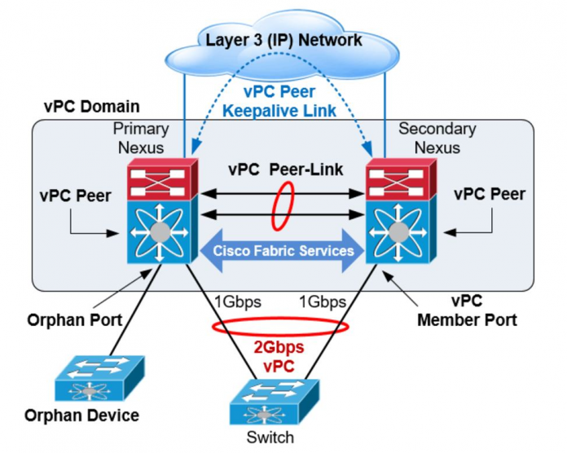

### VSS, Stack, VPC, MLAG
## 1. VSS (Virtual Switching System) 
- VSS (Virtual Switching System) là một công nghệ mạng của Cisco dùng để tạo một hệ thống switch core chạy song song như một thực thể đơn lẻ duy nhất
- VSS giúp đơn giản hóa quá trình cấu hình và vận hành hạ tầng mạng đảm bảo hệ thống sẽ không bị “loop” ở sơ đồ Layer 2 topology bằng cách gom 2 Catalyst switch thành một Virtual switch duy nhất 
- Một VSS là một cặp thiết bị catalyst switch hoạt động như một thiết bị mạng duy nhất với khả năng dự phòng (redundancy) và khả năng cân bằng tải (load balancing) dựa trên nền tảng port-channel (etherchannel). Một switch sẽ đóng vai trò làm master hoặc active chassis và switch còn lại sẽ đóng vai trò VSS standby
- `VSS Active`: Active chassis kiểm soát hoạt động của VSS. VSS hoạt động ở control plane dưới dạng giao thức L2 và L3 control protocol. Nó cũng có thể được vận hành dưới dạng chức năng management plane tương tự như console interface, logs, file system hoặc cũng có thể là power management. 
- `VSS Standby`: Theo dõi hoạt động và trạng thái của master, chịu trách nhiệm forward các lưu lượng ingress traffic nhưng các lưu lượng control traffic thì được gửi tới VSS active chassis để xử lý
- Cách thức hoạt động của VSS:
  - Với VSS, hai switch core (thường được gọi là switch 1 và switch 2) kết nối với nhau thông qua một liên kết VSL (Virtual Switch Link). Liên kết VSL này có nhiệm vụ tạo thành một liên kết logic giữa hai switch core để chúng hoạt động như một hệ thống duy nhất.
  - Các thiết bị kết nối với VSS được gọi là member switches. Khi được kết nối với VSS, chúng trở thành một phần của hệ thống VSS và được quản lý như một thực thể duy nhất
  - VSS chỉ cần một router active duy nhất, do đó giảm thiểu lưu lượng ARP (Address Resolution Protocol) và giúp cải thiện hiệu suất mạng. Cả hai switch core đều cùng nhau xử lý các tín hiệu ARP, tạo ra một môi trường chuyển mạch song song và tăng cường tính sẵn sàng
- Ưu, nhược điểm của VSS:
  - Ưu điểm:
    - Tăng tính sẵn sàng và khả năng chịu lỗi: VSS cho phép hai switch core hoạt động như một thực thể duy nhất, giúp tăng tính sẵn sàng của mạng. Nếu một trong hai switch core gặp sự cố, chuyển đổi hoàn toàn sang switch core còn lại xảy ra tự động và nhanh chóng, giảm thiểu thời gian chịu lỗi
    - Dễ quản lý: Với VSS, chỉ cần quản lý một hệ thống duy nhất thay vì hai switch core riêng biệt, giúp đơn giản hóa việc cấu hình và giám sát mạng
    - Phân phối tải thông minh: VSS cung cấp tính năng phân phối tải thông minh, giúp tối ưu hóa việc sử dụng tài nguyên mạng và cân bằng tải đều đặn trên các switch core.
  - Nhược điểm
    - Tính tương thích: VSS là một công nghệ của Cisco, do đó yêu cầu các thiết bị cần phải hỗ trợ VSS để có thể tích hợp vào hệ thống VSS
    - Chi phí: Triển khai VSS yêu cầu hai switch core đồng thời và một liên kết VSL, điều này có thể tăng chi phí so với triển khai hai switch core riêng lẻ.
## 2. Stack
- *Stack* còn gọi là Switch Stack, là một kỹ thuật kết nối nhiều switch cùng nhau để tạo thành một hệ thống switch duy nhất
- Stack cho phép quản lý nhiều switch như một thực thể duy nhất, giúp tăng cường tính sẵn sàng, dễ quản lý và hiệu suất của mạng
- Cách thức hoạt động của Stack:
  - Khi các switch được kết nối thành một Stack, chúng trở thành các thành viên của một hệ thống duy nhất. Stack sử dụng một liên kết backplane (liên kết chính) có băng thông cao để kết nối các switch với nhau. Điều này tạo ra một môi trường chuyển mạch song song, nơi dữ liệu có thể chuyển qua các switch một cách nhanh chóng và hiệu quả
  - Trong một Stack, chỉ có một switch được chọn làm Master Switch (chủ Stack) và các switch khác trong Stack là các Member Switch (thành viên Stack)
    - Master Switch là switch chịu trách nhiệm xử lý tất cả các tác vụ quản lý của Stack như cấu hình, cập nhật phần mềm, quản lý các thành viên khác trong Stack
    -  Các Member Switch sẽ chuyển tất cả các dữ liệu đến Master Switch để xử lý trước khi gửi đến đích

  - Khi một switch mới được thêm vào Stack, nó sẽ tự động hòa nhập với Stack và trở thành thành viên mới. Master Switch sẽ tự động quản lý cấu hình và xác định vị trí của thành viên mới trong hệ thống

- Ưu điểm của Stack:
  - Stack cho phép các switch hoạt động như một hệ thống duy nhất, giúp tăng tính sẵn sàng và giảm thiểu thời gian chịu lỗi khi một switch gặp sự cố
  - Quản lý một Stack dễ dàng hơn so với quản lý nhiều switch riêng biệt. Tất cả các switch trong Stack được quản lý như một thực thể duy nhất, giúp đơn giản hóa việc cấu hình và giám sát mạng
  - Stack sử dụng liên kết backplane có băng thông cao, giúp tăng cường hiệu suất dữ liệu và cải thiện hiệu suất mạng
- Nhược điểm của Stack:
  - Để triển khai Stack, các switch cần phải hỗ trợ tính năng Stack và cần phải chạy cùng phiên bản phần mềm hỗ trợ Stack
  - Số lượng switch có thể tham gia vào một Stack có giới hạn và khác nhau tùy theo mô hình cụ thể của nhà sản xuất
  - Stack có thể hữu ích cho các mạng nhỏ và trung bình, nhưng khi mạng phát triển lớn hơn, sự mở rộng có thể bị hạn chế.
## 3.vPC (virtual Port Chanel)
- `vPC (virtual Port Chanel)` là một công nghệ định tuyến trên mạng, được phát triển bởi Cisco, cho phép kết nối hai switch core song song với các thiết bị khác nhau thông qua các liên kết port channel (trunk) 10G hoặc 40G
- vPC giúp tăng tính sẵn sàng và khả năng chịu lỗi của mạng bằng cách xây dựng một liên kết ảo giữa hai switch, cho phép các thiết bị kết nối như là một thể thống nhất
- Thành phần của vPC
  
  - vPC Peer
    - Mô hình vPC bao gồm 2 thiết bị switch Cisco Nexus trong 1 cặp, một thiết bị hoạt động ở chế độ Primary và 1 thiết bị Secondary cho phép các thiết bị khác kết nối tới 2 switch này bằng Multi-Channel Ethernet (MEC). Hai thiết bị này được gọi là vPC Peer và được kết nối với nhau thông qua vPC Peer Link
  - vPC Peer Link
    - vPC peer-link là thành phần kết nối quan trọng nhất trong thiết lập vPC. vPC peer-link được sử dụng để đồng bộ hóa trạng thái giữa 2 thiết bị vPC thông qua các gói điều khiển vPC để tạo ra một mặt phẳng điều khiển duy nhất (1 switch logical). Trong trường hợp thiết bị vPC cũng là switch layer 3, vPC peer-link mang các gói Hot Standby Router Protocol (HSRP)
  - vPC Peer Keepalive Link
    - vPC Peer Keepalive Link là đường link Layer 3 được sử dụng để xác định các thiết bị trong cụm vPC và các đường vPC Peer Link có hoạt động hay không. Không có dữ liệu hay các gói tin đồng bộ đi qua vPC Peer Keepalive Link, chỉ có các gói tin IP/UDP sử dụng port 3200 để monitor switch và các peer link trong cụm vPC. Thời gian mặc định của các gói tin này là 1giây và timeout là 5 giây
  - vPC Domain
    - vPC domain là thông số để xác định các thiết bị switch Cisco Nexus nào đang chung 1 miền vPC. Các  Switch Nexus trong 1 cụm vPC phải chung vPC Domain
- Cách thức hoạt động của vPC:
  - vPC hoạt động bằng cách tạo ra một môi trường port channel ảo giữa hai switch core (thường được gọi là peer switches)
  - Các thiết bị kết nối sẽ trở thành vPC member (thành viên vPC) và được nhận diện là một cặp hợp lệ. Các thành viên vPC kết hợp các cổng thành các port channel đồng thời chạy thông qua liên kết vPC để tạo thành một đường truyền dữ liệu ảo
  - Khi một dữ liệu đến switch core, nó sẽ được đẩy xuống vPC peer link (liên kết vPC giữa hai switch), sau đó đi qua các port channel và được chia nhỏ để tiếp tục truyền đến các thiết bị kết nối thông qua các port channel cá nhân. Điều này tạo ra một môi trường chuyển mạch song song và cải thiện hiệu suất dữ liệu và khả năng chịu lỗi của mạng
- Ưu điểm của vPC:
  - Tăng tính sẵn sàng và khả năng chịu lỗi: vPC cung cấp một kiến trúc liên kết song song, giúp tăng khả năng sẵn sàng của mạng. Nếu một switch core gặp sự cố, dữ liệu có thể được tự động chuyển sang switch core còn lại, giảm thiểu thời gian chịu lỗi của hệ thống
  - Tính linh hoạt và mở rộng: vPC cho phép các thiết bị kết nối nhiều liên kết trở thành một thể thống nhất, tăng tính linh hoạt và mở rộng của mạng
  - Phân phối tải thông minh: vPC cho phép phân phối tải tự động và cân bằng tải dữ liệu qua các liên kết, giúp tối ưu hóa sử dụng tài nguyên mạng
- Nhược điểm của vPC:
  - Yêu cầu phần cứng và phần mềm tương thích: Vì vPC là một công nghệ Cisco, việc triển khai yêu cầu sử dụng các thiết bị Cisco tương thích với vPC và các phiên bản phần mềm hỗ trợ
  - Phức tạp trong triển khai: Cấu hình và triển khai vPC có thể phức tạp và yêu cầu kiến thức cao về mạng
  - Vulnerability: Trong một số tình huống, lỗi cấu hình hoặc sự cố có thể dẫn đến hiện tượng vPC Split Brain, khi dữ liệu có thể bị sao chép và gửi đến cả hai switch core, gây ra mất dữ liệu hoặc xung đột dữ liệu
### 4. MLAG
- *MLAG (Multi-Chassis Link Aggregation)* là một công nghệ trong mạng máy tính được sử dụng để tạo một hệ thống chuyển mạch song song với nhiều switch core (core switches) làm việc cùng nhau để cung cấp tính sẵn sàng cao và cân bằng tải thông minh
- Cách thức hoạt động của MLAG:
  - Trong hệ thống MLAG, hai hoặc nhiều switch core được kết nối với nhau thông qua các liên kết truyền thông song song, chẳng hạn như các liên kết 10G hoặc 40G. Các switch core này được cấu hình để hoạt động như một hệ thống logic duy nhất, trong đó một switch core được chọn làm switch active và switch core khác là switch standby
  - Khi một thiết bị kết nối vào hệ thống MLAG, nó được xem như một đường truyền dữ liệu logic gồm các liên kết từ cả hai switch core. Dữ liệu được truyền qua hệ thống MLAG thông qua switch active, và nếu switch active gặp sự cố, switch standby sẽ tự động tiếp quản việc xử lý dữ liệu mà không có sự gián đoạn trong dịch vụ
  - MLAG cho phép tạo các link aggregation groups (LAGs) bao gồm các cổng từ cả hai switch core, tạo thành một môi trường chuyển mạch song song và tăng cường tính sẵn sàng và khả năng chịu lỗi của mạng
- Ưu điểm của MLAG:
  - Tăng tính sẵn sàng và khả năng chịu lỗi: MLAG giúp tăng cường tính sẵn sàng của mạng bằng cách cung cấp hai switch core hoạt động như một hệ thống duy nhất. Nếu một switch core gặp sự cố, switch core khác sẽ tiếp quản mà không gây gián đoạn dịch vụ
  - Phân phối tải thông minh: MLAG cho phép phân phối tải thông minh và cân bằng tải giữa các switch core, giúp tối ưu hóa sử dụng tài nguyên mạng
  - Khả năng mở rộng: MLAG cho phép mở rộng hệ thống chuyển mạch bằng cách thêm các switch core vào hệ thống, tạo thành mạng lõi lớn hơn với tính sẵn sàng cao.

- Nhược điểm của MLAG:
  - Yêu cầu phần cứng tương thích: MLAG đòi hỏi các switch core phải hỗ trợ công nghệ này, và chúng phải cùng một nhà cung cấp hoặc tương thích với nhau
  - Phức tạp trong triển khai: Cấu hình và triển khai MLAG có thể phức tạp và yêu cầu kiến thức cao về mạng
  - Cấu hình đòi hỏi chính xác: Một cấu hình không chính xác có thể dẫn đến các sự cố hoặc vấn đề về hiệu suất của hệ thống MLAG
