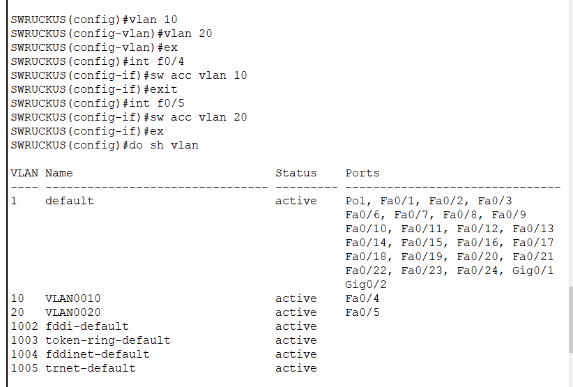

## Thực hành LAB:
### 1. Cấu hình LACP 


- SW RUCKUS
  
  
- SW CISCO
  
  
### 2. Cấu hình Sub Interface
- Cấu hình ip trên Router

  


- Cấu hình trên SWRUCKUS
  - Cấu hình trunk
  ```
  SWRUCKUS(config)#int f0/1 - 2
  SWRUCKUS(config-if)#switchport mode trunk
  SWRUCKUS(config)#int f0/3
  SWRUCKUS(config-if)#switchport mode trunk
  ```
  
  

- Cấu hình trên SWCISCO
  - Cấu hình trunk
  ```
  SWCISCO(config)#int f0/1 - 2
  SWCISCO(config-if)#switchport mode trunk
  ```

  

- Kiểm tra kết quả
  
  


### 3. Cấu hình định tuyến OSPF, BGP
- Sơ đồ cấu hình 

  

- Yêu cầu  
  - Cấu hình địa chỉ IP cho các Router
  - Cấu hình OSPF cho các Router
  - Cấu hình BGP cho các Router
- Thực hiện
  - Cấu hình OSPF
  ```
  R1(config)#router ospf 1
  R1(config-router)# net 192.168.1.0 0.0.0.255 area 100
  R1(config-router)# net 201.0.0.0 0.0.0.255 area 100
  ```


  - Cấu hình BGP
  ```
  R1(config)#router bgp 100
  R1(config-router)# network 201.0.0.0
  R1(config-router)# neighbor 192.168.1.2 remote-as 100
  ```
  - Cấu hình trên R1

    

  - Cấu hình trên R2

    

  - Cấu hình trên R3

    

  - Cấu hình trên R4

    


### 4. Cấu hình port-channel, Virtual port channel/MLAG
### 5. Cấu hình ACCESS-LIST
- 
### 6. Cấu hình Policy Based Routing
### 7. Cấu hình dự phòng gateway HSPR/VRRP/GLBP.