## Cấu hình chính sách fw:RDP, SMB, FTP, HTTP, DNS,SSH, HTTPS, HCP, NTP
### 1. Cấu hình FW
- Sơ đồ: 

  

- Cấu hình trên FW
  - Cắm dây console trên FW và đặt địa chỉ cho cổng mgt
  
  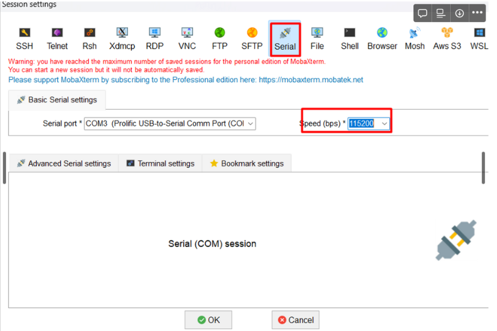

  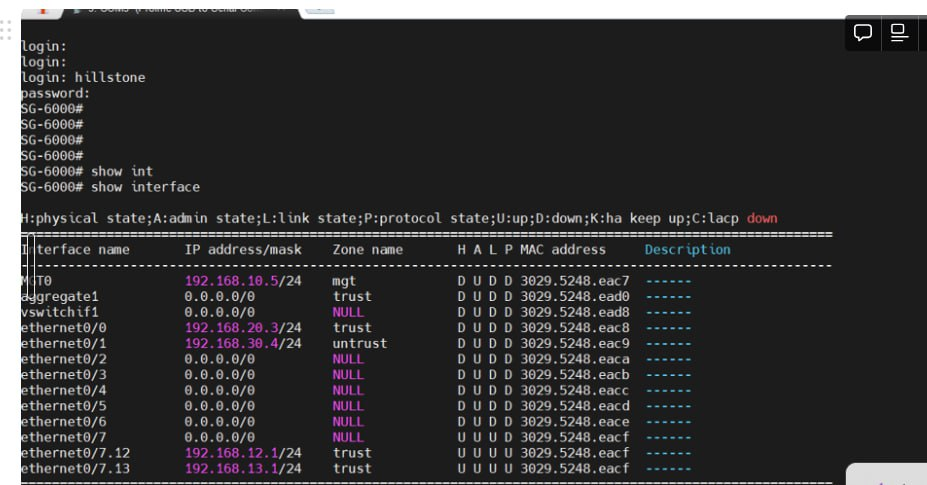

  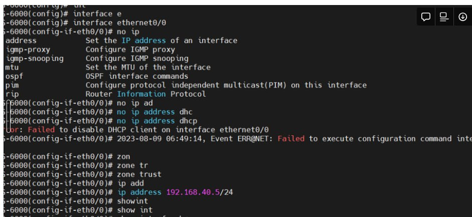

  - Đổi địa chỉ IPv4
  
  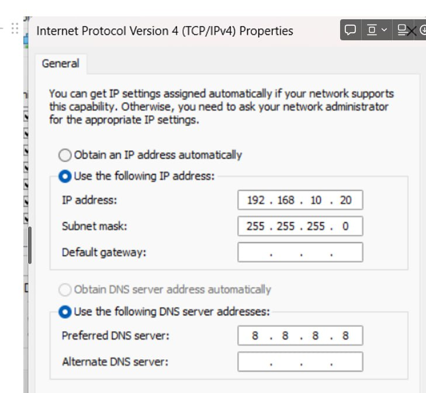

  - Truy cập vào quản lý FW
  > https://192.168.10.5

  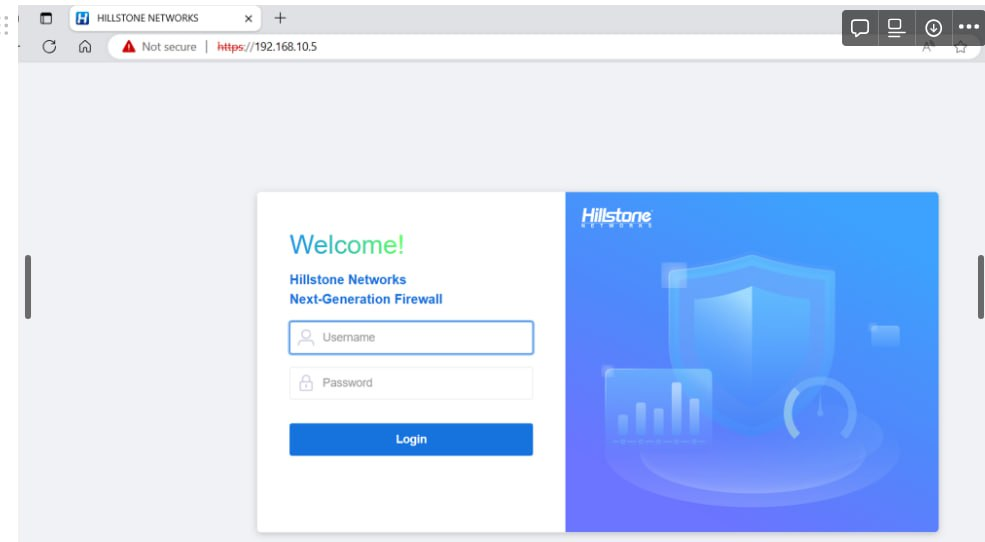

  - Tạo sub-interface trên FW
  
  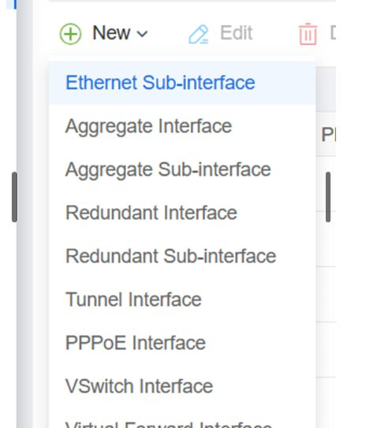

  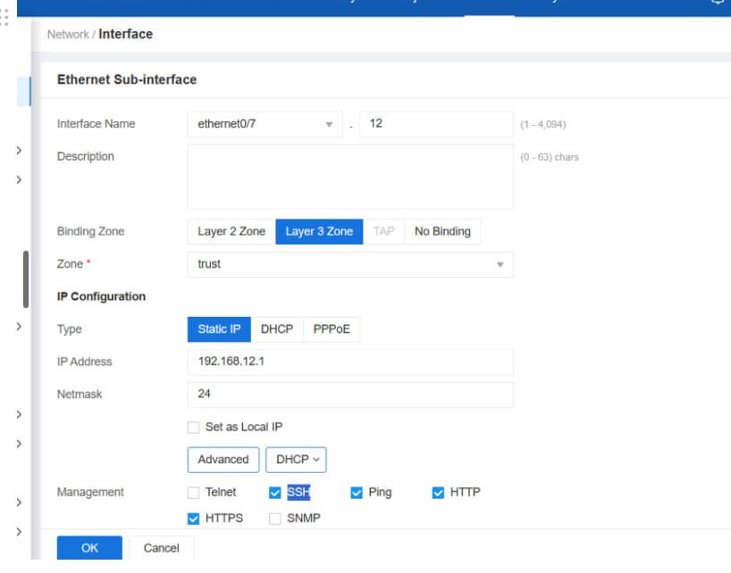

- Tắt kết nối Wifi và tắt firewall trên cả 2 máy pc và thực hiện ping để kiểm tra xem 2 pc đã thông với nhau chưa
  
  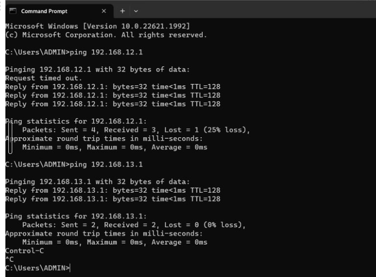

### 2. Cấu hình chính sách fw: RDP
- Mục đích: Kiểm thử tính năng kiểm soát RDP truy cập trên hillstone firewall cho các thiết bị trong hệ thống

- Kịch bản:
  - Bật chế độ RDP trên 2 pc
  - Tạo policy trên Firewall thực hiện block service RDP từ PC 192.168.16.15 truy cập RDP đến PC 192.168.15.20
- Các bước thực hiện :
  - B1: Tạo policy any any
  
    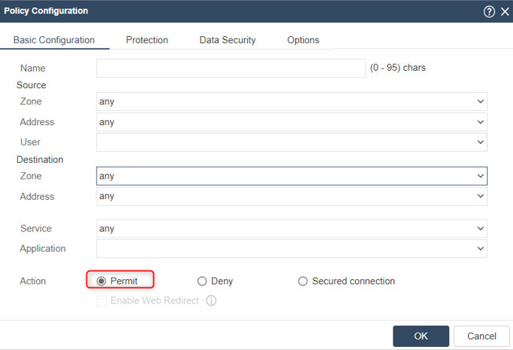

  - B2: Kiểm tra kết nối RDP từ PC 192.168.16.15 truy cập RDP đến PC 192.168.15.20
    - PC 192.168.16.15 có thể truy cập RDP đến PC 192.168.15.20

    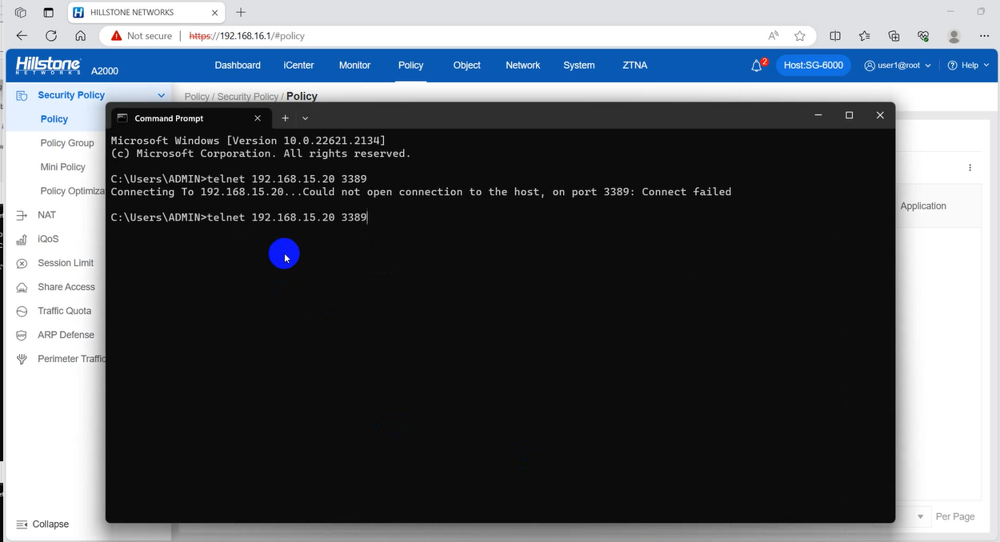

    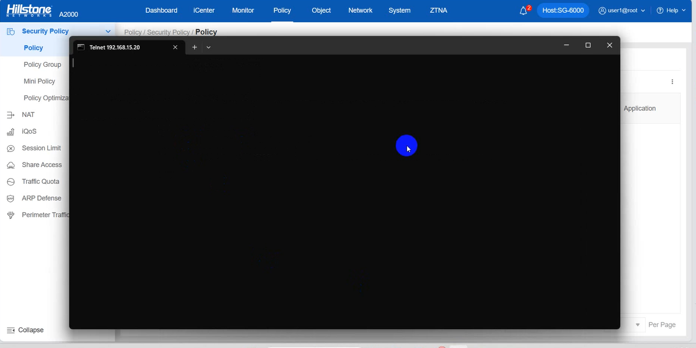

  - B3: Tạo policy deny RDP từ PC 192.168.16.15 truy cập RDP đến PC 192.168.15.20
  
    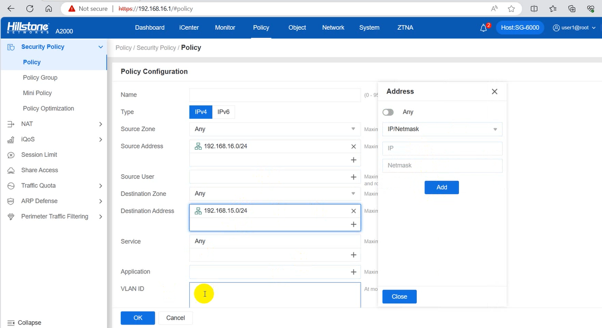

    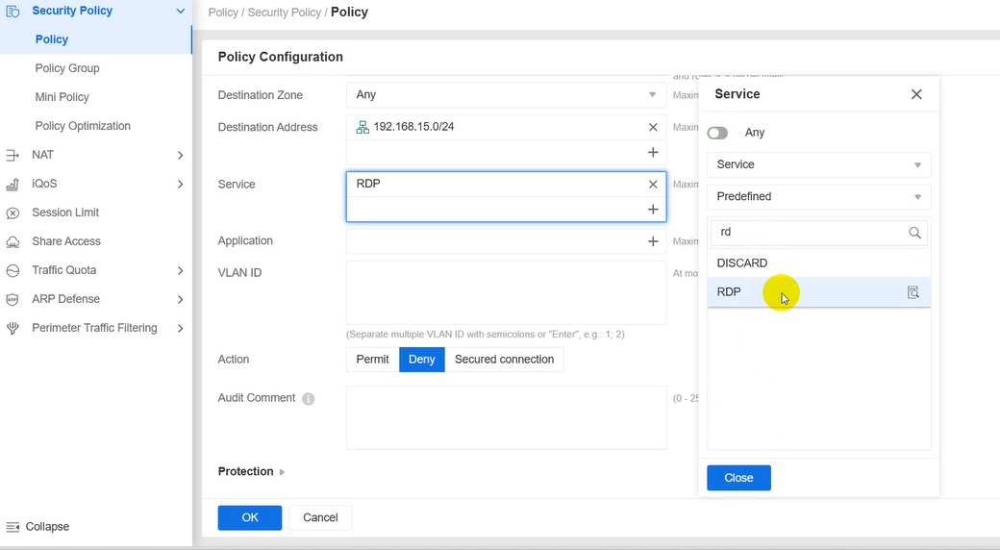

    - Policy sẽ thực hiện lần lượt từ trên xuống nên cần đẩy policy deny RDP lên Top
  
    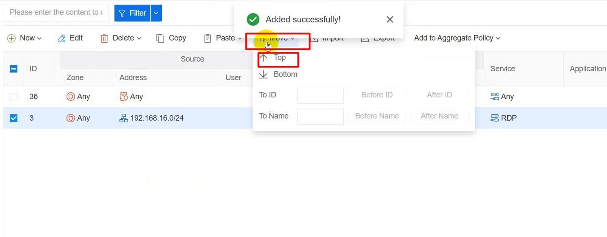

  - B4: Kiểm tra kết nối RDP sau khi cấu hình policy từ PC 192.168.16.15 truy cập RDP đến PC 192.168.15.20
    - Truy cập RDP từ PC 192.168.16.15 truy cập RDP đến PC 192.168.15.20 đã bị chặn
  
    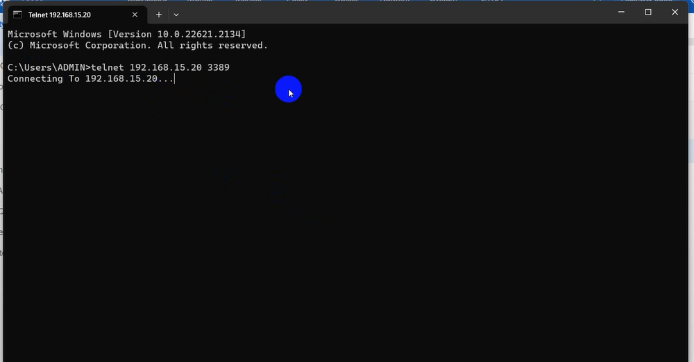

### 3. Cấu hình chính sách fw: SMB
- Kịch bản :
  - Tạo policy trên Firewall thực hiện block service SMB từ PC 192.168.12.15 đến PC 192.168.13.15
- - Các bước thực hiện :
  - B1: Tạo policy any any
  
    

  - B2: Kiểm tra kết nối 
   ctrl + r --> \\\192.168.13.15
    
    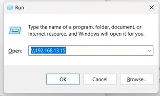

    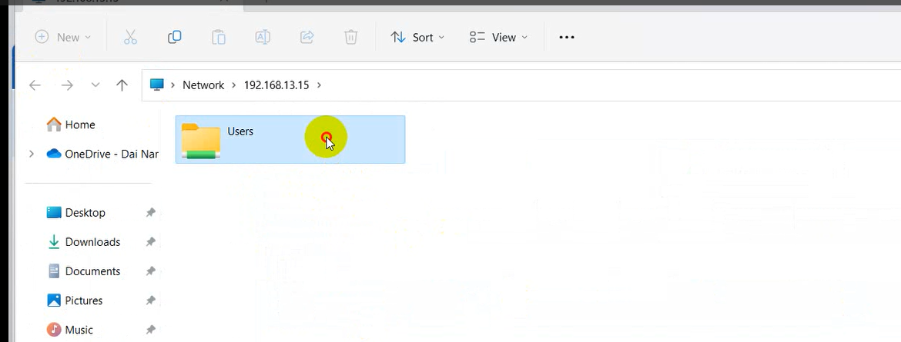

  - B3: Tạo policy deny SMB 
  
    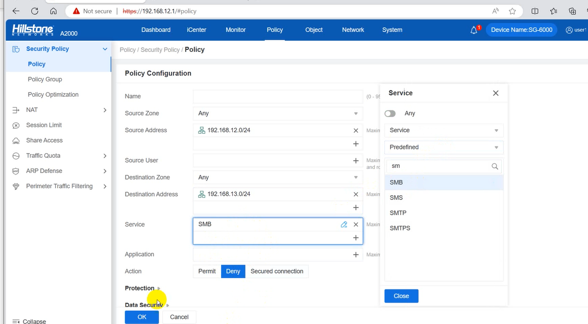

  - B4: Kiểm tra kết nối SMB sau khi cấu hình policy từ PC 192.168.12.15 truy cập đến PC 192.168.13.50. 
    - Truy cập SMB từ PC 192.168.12.15 truy cập đến PC 192.168.13.50 đã bị chặn, không thể kết nối \\\192.168.12.15

### 4. Cấu hình chính sách fw: FTP
### 5. Cấu hình chính sách fw: HTTP, HTTPS
- Kịch bản :
  - Tạo policy trên Firewall thực hiện block service HTTP từ PC 192.168.12.15 truy cập đến PC 192.168.13.50
- Các bước thực hiện :
  - Tạo policy any any
  
    

  - Kiểm tra kết nối HTTP, HTTPS 
  
    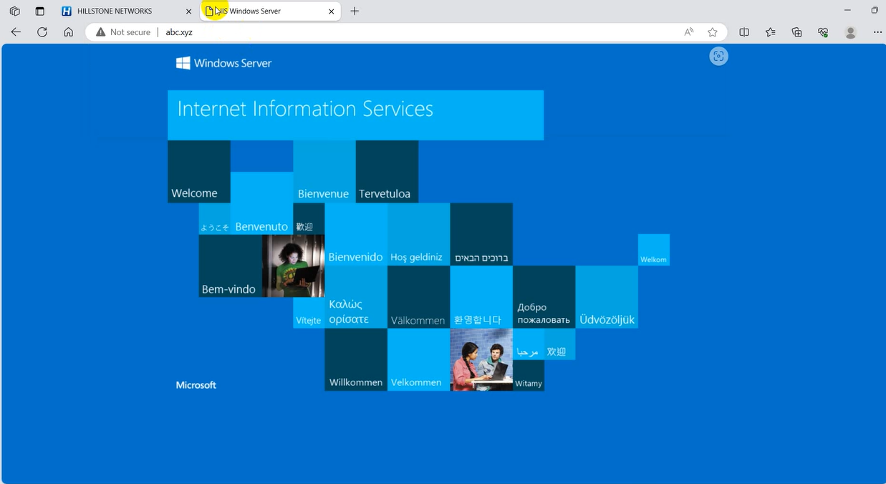

  - Tạo policy deny HTTP, HTTPS 
  
    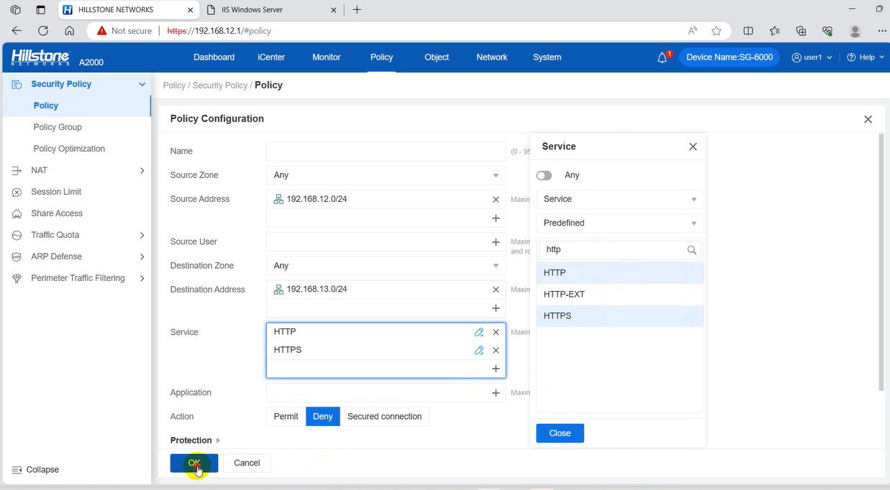

  - Kiểm tra kết nối HTTP, HTTPS sau khi cấu hình policy 
  
    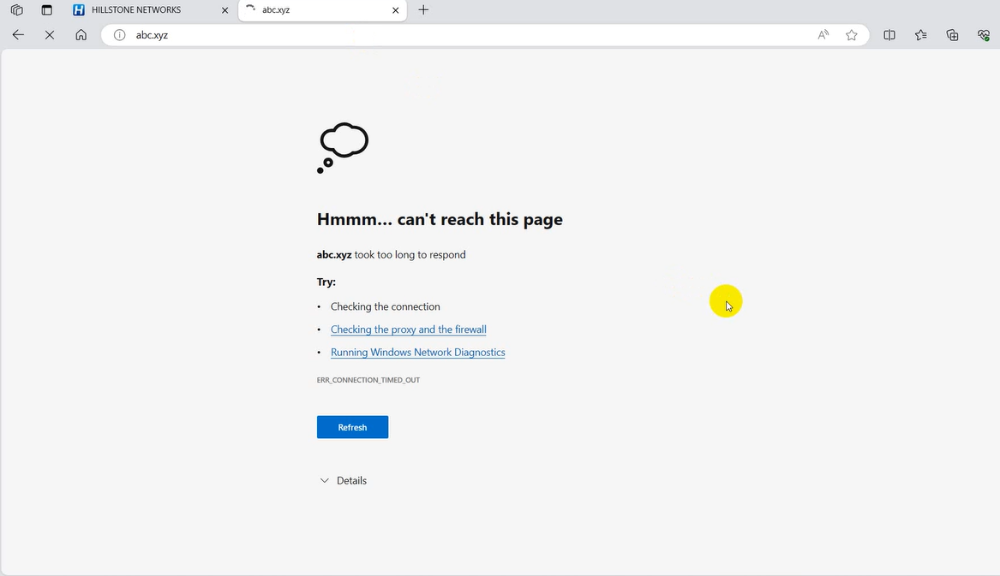

### 6. Cấu hình chính sách fw: DNS
### 7. Cấu hình chính sách fw: SSH
### 8. Cấu hình chính sách fw: DHCP
### 9. Cấu hình chính sách fw: NTP
